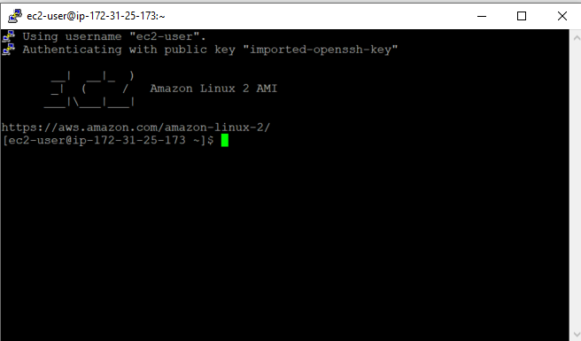
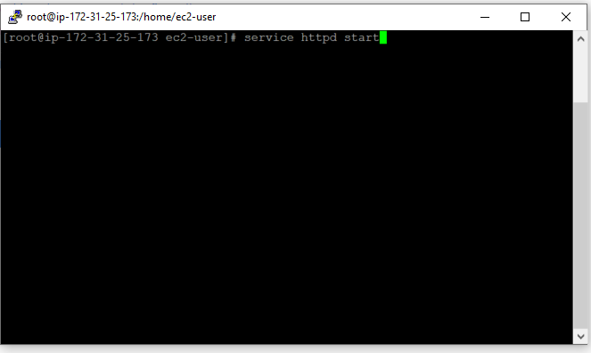

<!-- ABOUT THE PROJECT -->

## Make an EC2 Instance a webserver and Bootstrapping

### Project Description

This is fairly a simple project in two parts. The first part focuses on creating an EC2 instance from the AWS Management Console and then connecting to this instance from Putty. Then follow some manual process to install Apache Web Server and print the instance id in the html page. The second part of this project focuses on automating the whole process by bootstrapping the EC2 instance.

### Follow Along:

Create any Free Tier eligible EC2 instance. Use "Putty" and "PuttyGen" to convert the key-pair pem file to a ppk file. After successfully login to the EC2 instance from putty, it should like something like this:

<!-- CONTACT -->

## Contact

Pritom Das Radheshyam - [Portfolio Website](https://pritom.uwu.ai/)
[![LinkedIn][linkedin-shield]][linkedin-url]  
[Dhruv Mehta] [![LinkedIn][linkedin-shield]][linkedin-url-dm]

<!-- MARKDOWN LINKS & IMAGES -->
<!-- https://www.markdownguide.org/basic-syntax/#reference-style-links -->

[linkedin-shield]: https://img.shields.io/badge/-LinkedIn-black.svg?style=flat-square&logo=linkedin&colorB=555
[linkedin-url]: https://www.linkedin.com/in/you-found-pritom
[linkedin-url-dm]: https://www.linkedin.com/in/dhruv-mehta212/
[product-screenshot]: images/screenshot.jpg
[Dhruv Mehta]: https://github.com/mehtadhruv1
