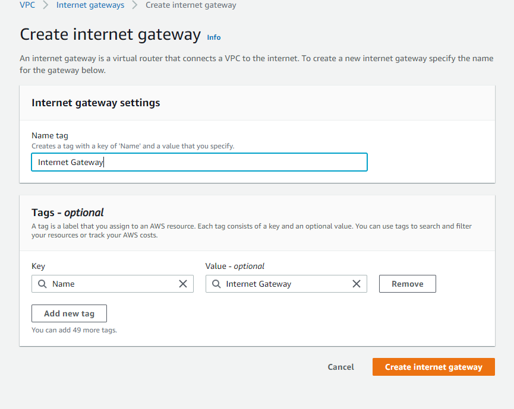
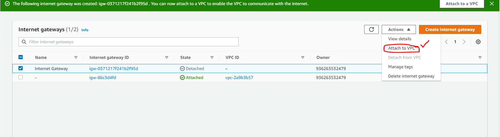
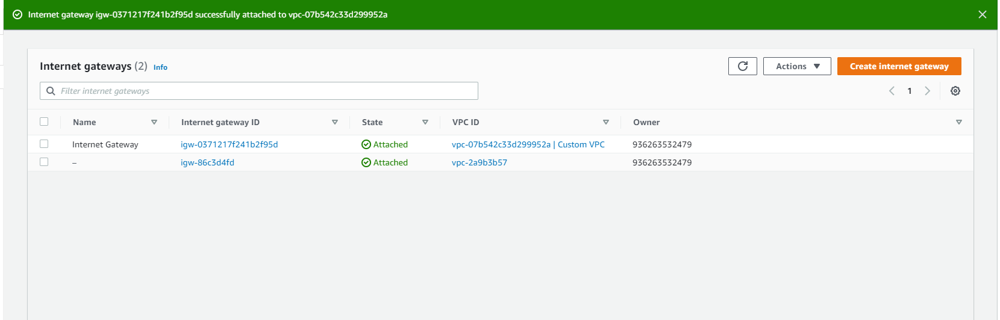

<!-- PROJECT LOGO -->
 

  

> AWS, VPC, Custom VPC, Public Subnet, Private Subnet

<!-- ABOUT THE PROJECT -->

# Create Custom VPC with public and private subnet

## Project Description

This is fairly a simple project in two parts. The first part focuses on creating an EC2 instance from the AWS Management Console and then connecting to this instance from Putty. Then follow some manual process to install Apache Web Server and print the instance id in the html page. The second part of this project focuses on automating the whole process by bootstrapping the EC2 instance.

## Follow Along:

### Part 1
Create any Free Tier eligible EC2 instance. Use "Putty" and "PuttyGen" to convert the key-pair pem file to a ppk file. After successfully login to the EC2 instance from putty, it should like something like this:

Install Apache Web Server in the EC2 instance:

Print the instance id as the index.html page for the Apache web server

Start the Apache Web Server

Copy the Public IPv4 address and view it in browser

The Final Output for Part 1:

### Part 2: Bootstrap

Create another free tier eligible EC2 instance and in the "User Data" write like the following:

The Final Output for Part 2:

<!-- CONTACT -->

## Contact

Pritom Das Radheshyam - [Portfolio Website](https://pritom.uwu.ai/)
[![LinkedIn][linkedin-shield]][linkedin-url]  

<!-- MARKDOWN LINKS & IMAGES -->
<!-- https://www.markdownguide.org/basic-syntax/#reference-style-links -->

[linkedin-shield]: https://img.shields.io/badge/-LinkedIn-black.svg?style=flat-square&logo=linkedin&colorB=555
[linkedin-url]: https://www.linkedin.com/in/you-found-pritom
[product-screenshot]: images/screenshot.jpg

