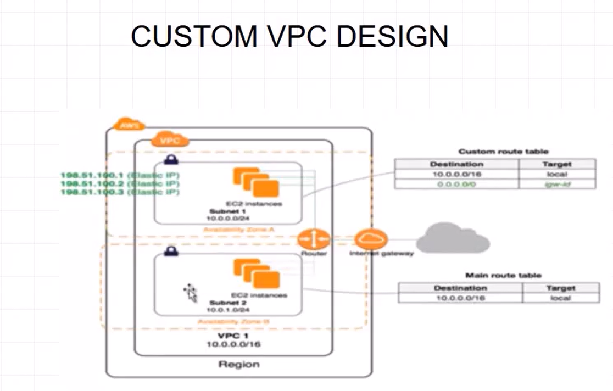
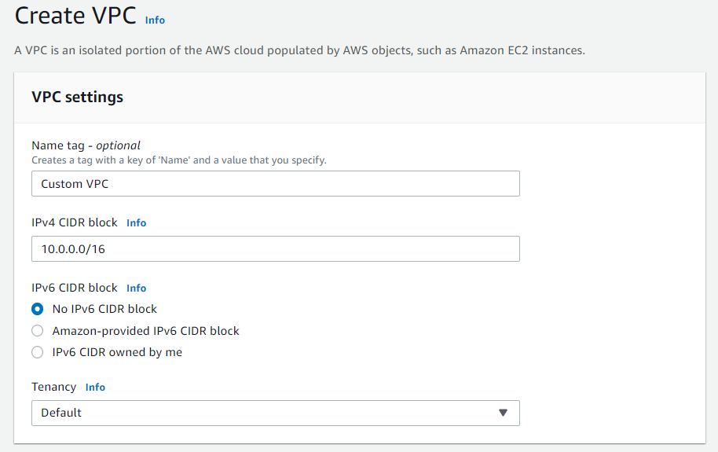
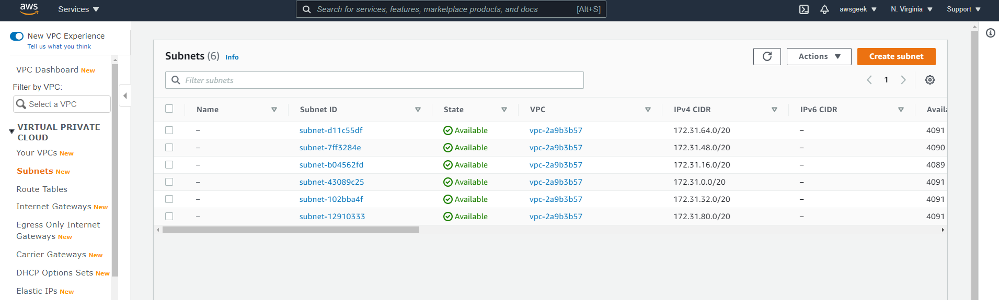
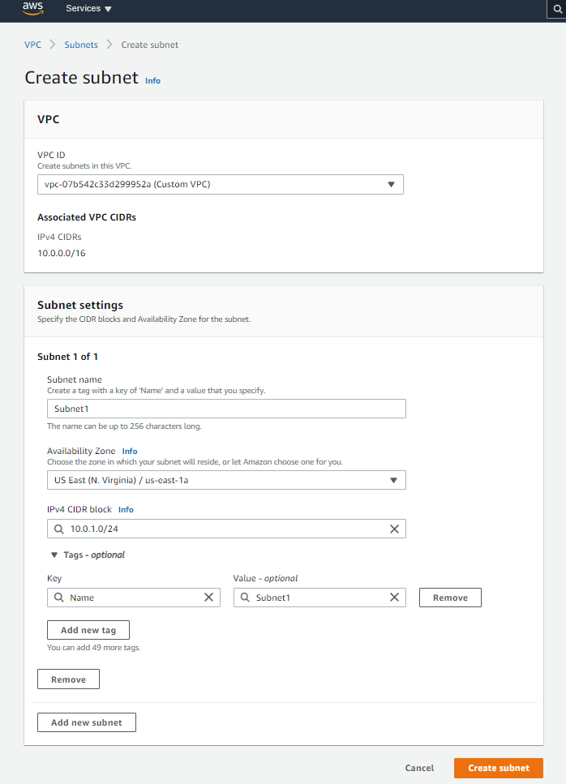
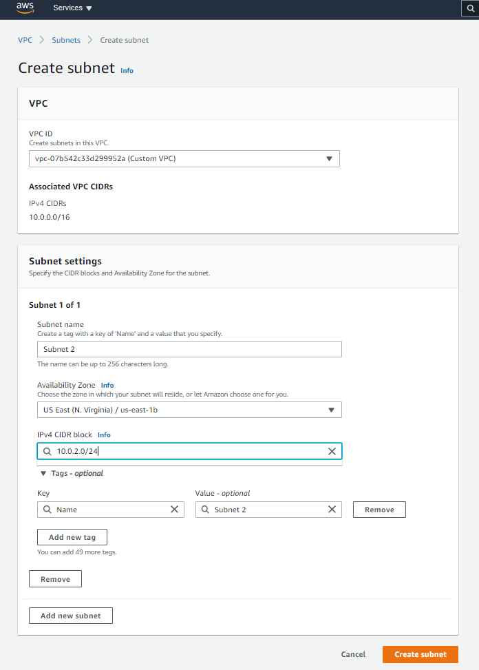

<!-- PROJECT LOGO -->
 

  

> AWS, VPC, Custom VPC, Public Subnet, Private Subnet

<!-- ABOUT THE PROJECT -->

# Create Custom VPC with public and private subnet

## Project Description

In this project I have created a custom VPC in AWS. The reference architecture diagram is provided as the project logo. I have created two subnets where one is a public subnet and the other is a private subnet. The public subnet could simulate as Web Server which is the Application Tier. For maintaining security concerns, the private subnet could simulate as Database Server which is the Database Tier.

## Follow Along:

Create VPC in the AWS Management Console:

Create new subnets, I will create two subnets where I will make one public subnet and one private subnet:

Print the instance id as the index.html page for the Apache web server

Start the Apache Web Server

Copy the Public IPv4 address and view it in browser

The Final Output for Part 1:

### Part 2: Bootstrap

Create another free tier eligible EC2 instance and in the "User Data" write like the following:

The Final Output for Part 2:

<!-- CONTACT -->

## Contact

Pritom Das Radheshyam - [Portfolio Website](https://pritom.uwu.ai/)
[![LinkedIn][linkedin-shield]][linkedin-url]  

<!-- MARKDOWN LINKS & IMAGES -->
<!-- https://www.markdownguide.org/basic-syntax/#reference-style-links -->

[linkedin-shield]: https://img.shields.io/badge/-LinkedIn-black.svg?style=flat-square&logo=linkedin&colorB=555
[linkedin-url]: https://www.linkedin.com/in/you-found-pritom
[product-screenshot]: images/screenshot.jpg

