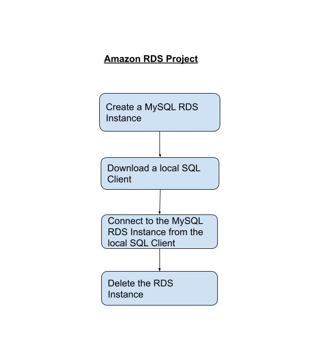
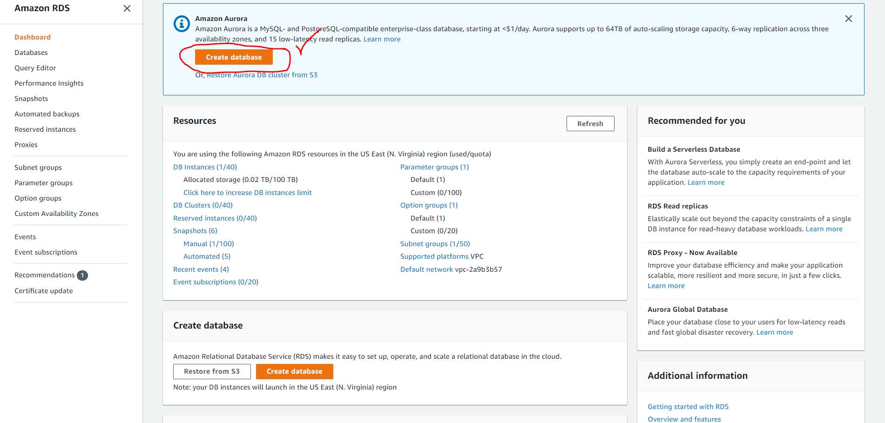
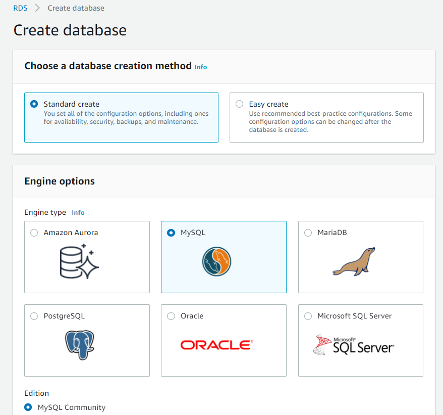
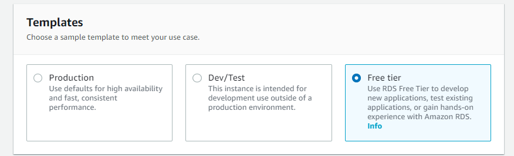
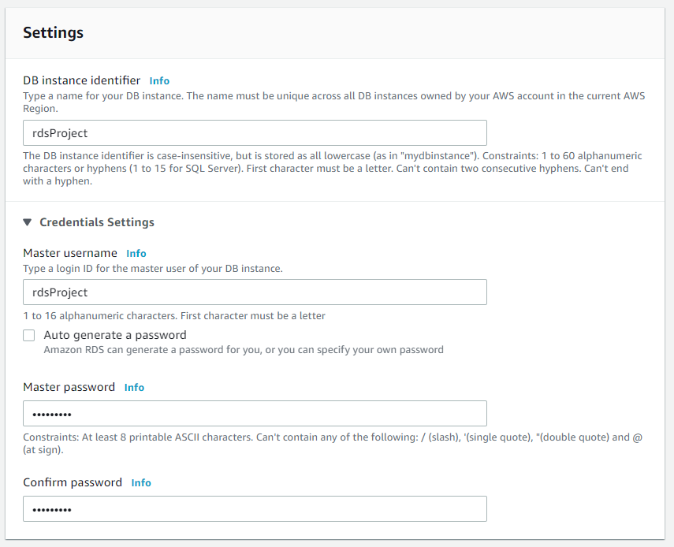
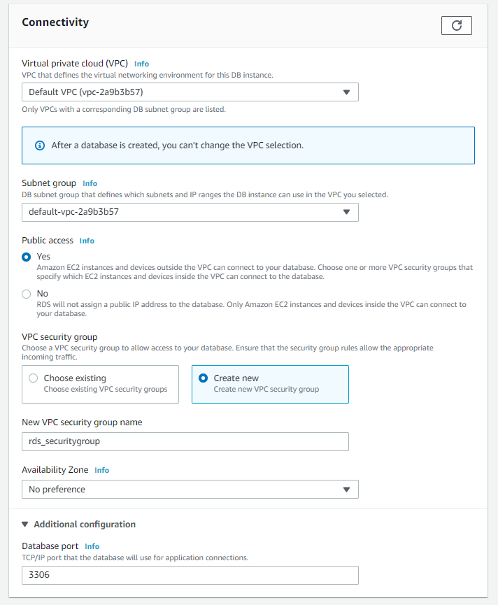
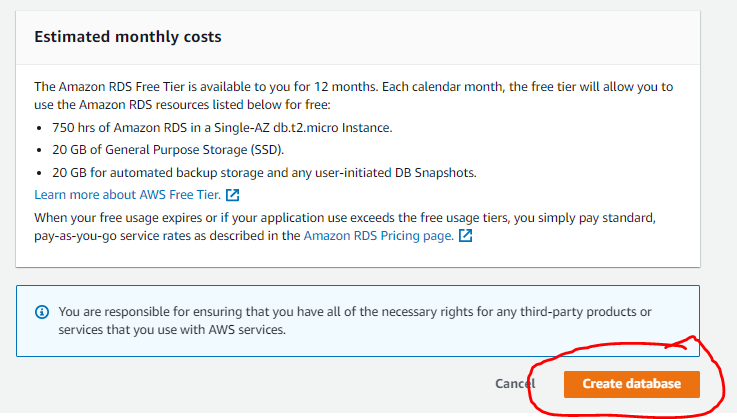
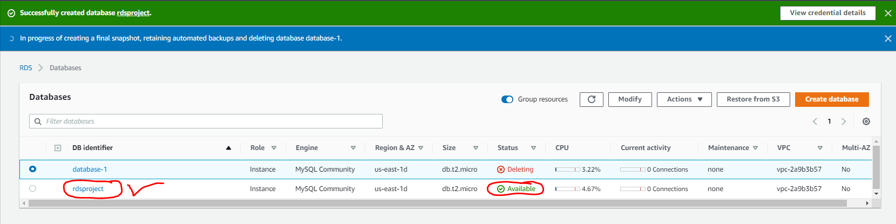
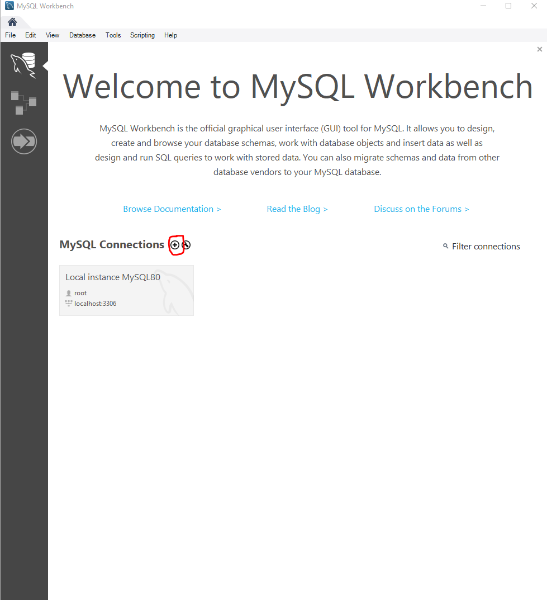

<!-- PROJECT LOGO -->
 

  

> AWS, RDS, MySQL, MySQL Workbench
<!-- ABOUT THE PROJECT -->

# Connecting AWS RDS with local SQL Client

## Project Description
This is a very simple project where we will work with AWS RDS. We will create a free tier eligible MySQL RDS Database Instance. We will then install a local SQL client in our local environment. We will connect the the local SQL client with the AWS RDS Database instance that we have just created. After successful creation, we will delete all the created resources.

## Follow Along:

### Part 1: Create a MySQL RDS Instance

Head over to the AWS Management Console and seach "RDS" in services. Then locate "create database" :

Choose "Standard Create" in the database creation method and in engine options let's select "MySQL" :

Since we are creating this project for practice, select "Free Tier" in templates:

Give desired credentials to create your own RDS instance:

Pay close attention to "Connectivity". Let's choose "Public Access" as "Yes". We will also create a new security group instead of the default security group.

The Final Output for Part 1:

### Part 2: Bootstrap

Create another free tier eligible EC2 instance and in the "User Data" write like the following:

The Final Output for Part 2:

<!-- CONTACT -->

## Contact

Pritom Das Radheshyam - [Portfolio Website](https://pritom.uwu.ai/)
[![LinkedIn][linkedin-shield]][linkedin-url]  

<!-- MARKDOWN LINKS & IMAGES -->
<!-- https://www.markdownguide.org/basic-syntax/#reference-style-links -->

[linkedin-shield]: https://img.shields.io/badge/-LinkedIn-black.svg?style=flat-square&logo=linkedin&colorB=555
[linkedin-url]: https://www.linkedin.com/in/you-found-pritom
[product-screenshot]: images/screenshot.jpg

