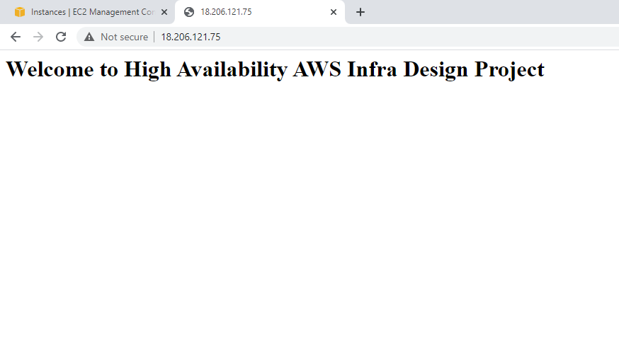
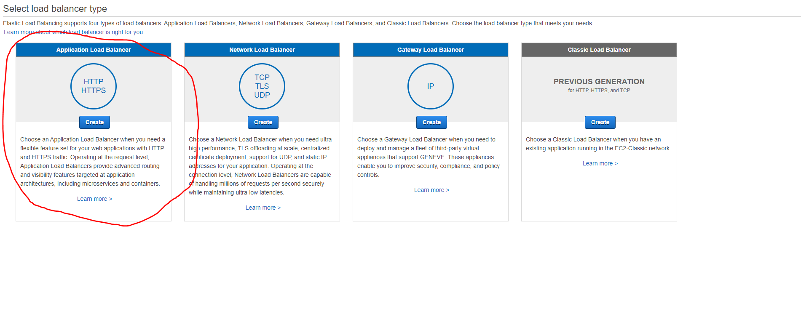

<!-- PROJECT LOGO -->
 

  

> AWS, ELB, ASG, Launch Configuration
<!-- ABOUT THE PROJECT -->

# Designing High Availability AWS Infrastructure

## Project Description
This is a medium difficulty level project. Based on the reference architecture diagram, we will design high available system. We will create AMI for our desired EC2 Instances which will be bootstrapped for starting an Apache Webserver. We will create load balancers, launch configurations and auto scaling groups. We will run 2 EC2 instances in different public subnets and it gets auto provisioned when old EC2 Instances are down.

## Follow Along:

### Part 1: Create AMI from an EC2 Instance

Head over to EC2 in services from AWS Management Console. Then "Launch Instance" :

We will create free tier eligible instance :

Keep everything default, we will provide the Bootstrap Script in the "User Data" from the "Advanced Settings" :

Here is the Bootstrap Script for better view:

In the security group we will open another rule for "HTTP" connection:

Now let's check if our webserver is serving the desired content properly or not. Grab the Public IPv4 address:

If the webserver is working correctly, then it should view this in a new browser :

Now, we will create an AMI from this EC2 instance that we have just deployed. Follow the picture given below to create an image:

Keep veryhting default and give a name to this image:

Now go to "Images" section and click "AMIs". Our new image should show "available" in status:

Now we can terminate the EC2 instance that we have created, the main purpose was to create a custom AMI which we have completed:

### Part 2: Creating Application Load Balancer

Go to Load Balancer, create a new load balancer and choose Application Load Balancer :

Give a name to the Load Balancer and choose two availability zones. Make sure these availability zones are part of public subnet and not private subnet :

We will create a new security group and keep the default rule :

After successfully creating the load balancer:

### Delete the RDS Instance
Don't forget to delete all the RDS Instance as one can be billed after the free tier quota is over.

<!-- CONTACT -->

## Contact

Pritom Das Radheshyam - [Portfolio Website](https://pritom.uwu.ai/)
[![LinkedIn][linkedin-shield]][linkedin-url]  

<!-- MARKDOWN LINKS & IMAGES -->
<!-- https://www.markdownguide.org/basic-syntax/#reference-style-links -->

[linkedin-shield]: https://img.shields.io/badge/-LinkedIn-black.svg?style=flat-square&logo=linkedin&colorB=555
[linkedin-url]: https://www.linkedin.com/in/you-found-pritom
[product-screenshot]: images/screenshot.jpg

