<!-- PROJECT LOGO -->
 

  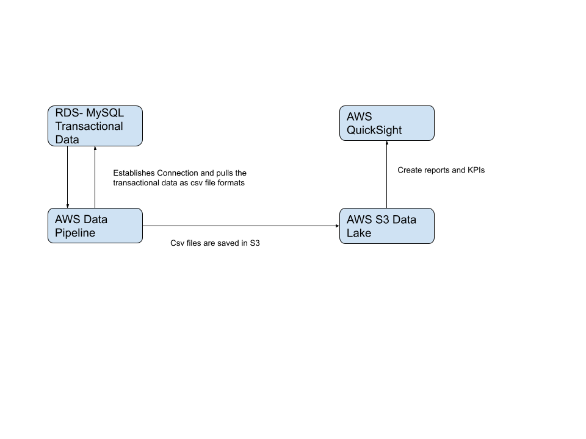

> AWS, RDS, MySQL, DBeaver, AWS Data Pipeline, AWS S3, AWS Quicksight
<!-- ABOUT THE PROJECT -->

# Data Engineering and Business Intelligence in AWS

## Project Description
This is full end project where we try to simulate real cloud migration scenario. We will migrate our transactional data from On-Premise to AWS using AWS RDS MySQL. We also need to get insights from our data to make business decisions. We will use AWS Data Pipeline to convert the OLTP data to OLAP data for analytical purposes. The AWS Data Pipeline will fetch data from our RDS and convert it to our desired schema and push it to AWS S3. Here we will use AWS S3 as Data Lake and the AWS Data Pipleine will run automatically in certain intervals to push incremental updates in the S3. We will integrate AWs Quicksight for our Business Intelligence needs which will fetch datasets from our S3 and produce dashboards to get business insights, reports and KPIs.

## Follow Along:

### Part 1: AWS RDS and DBeaver

Head over to the AWS Management Console and seach "RDS" in services. Choose "Create Database" and from all the options of various SQL Engines, we will opt for MySQL. Make sure to choose "Free Tier" and proceed by keeping everything default :

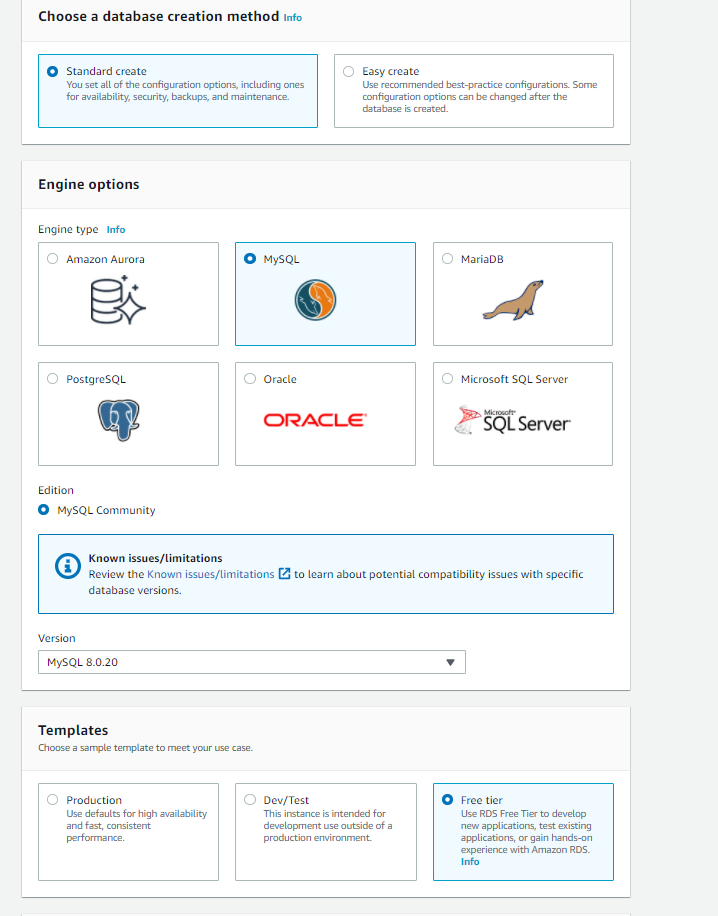

In "Connectivity" have "Public Access":

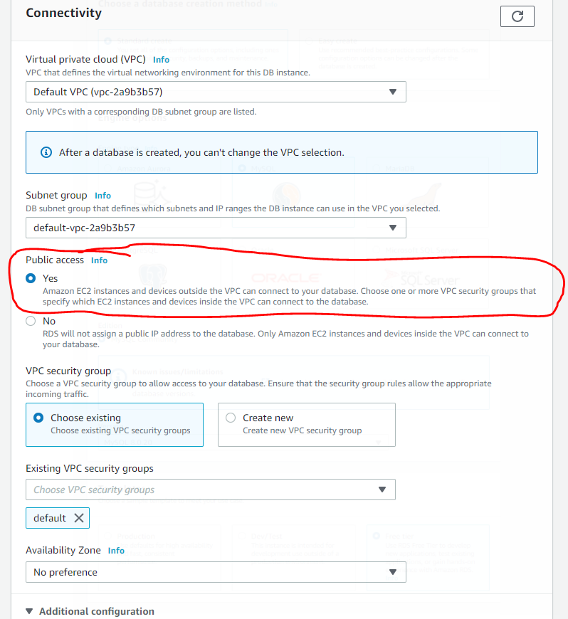

After successfully creating the database:

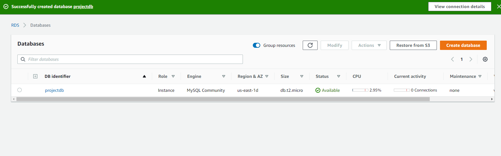

Install a tool called DBeaver in our local machine. DBeaver is a SQL client software application and a database administration tool. For relational databases it uses the JDBC application programming interface to interact with databases via a JDBC driver. Assuming that we have completed the installation process, we will create a new database connection to our AWS RDS MySQL Instance:

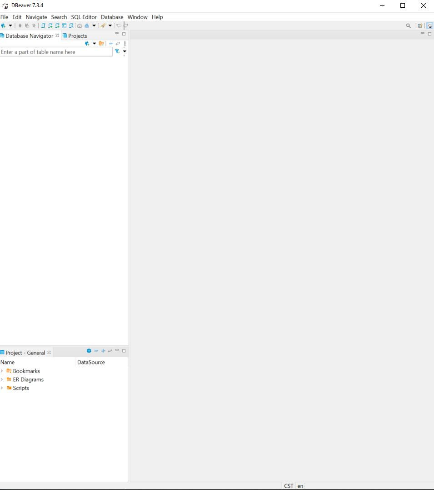

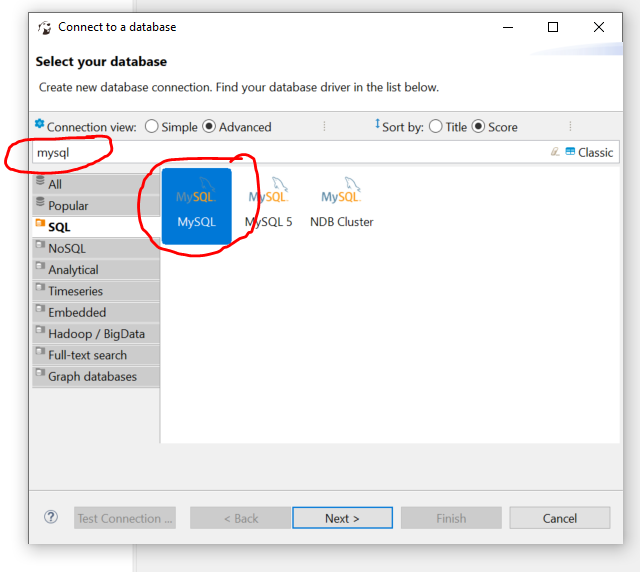

We need to edit our security group in the VPC section that we used for the AWS RDS. We will add a new inbound rule which will allow our RDS Instance to be accessible remotely by our IP Address. Few Screenshots are attached to explain this procedure:

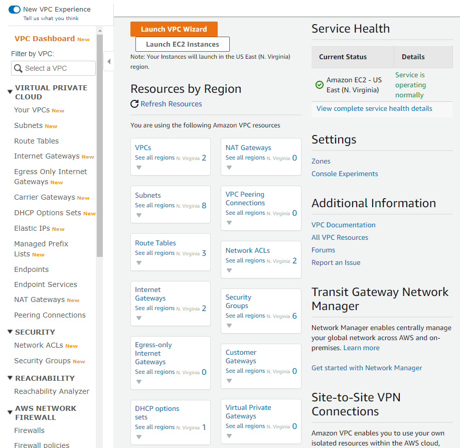

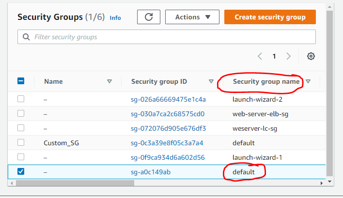

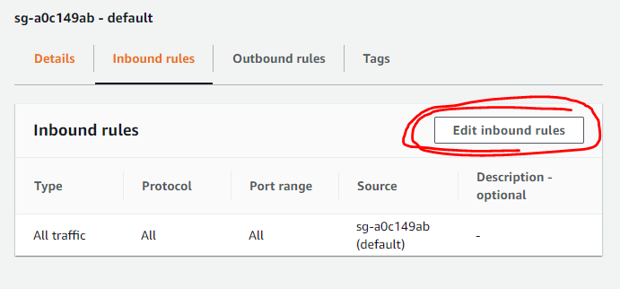

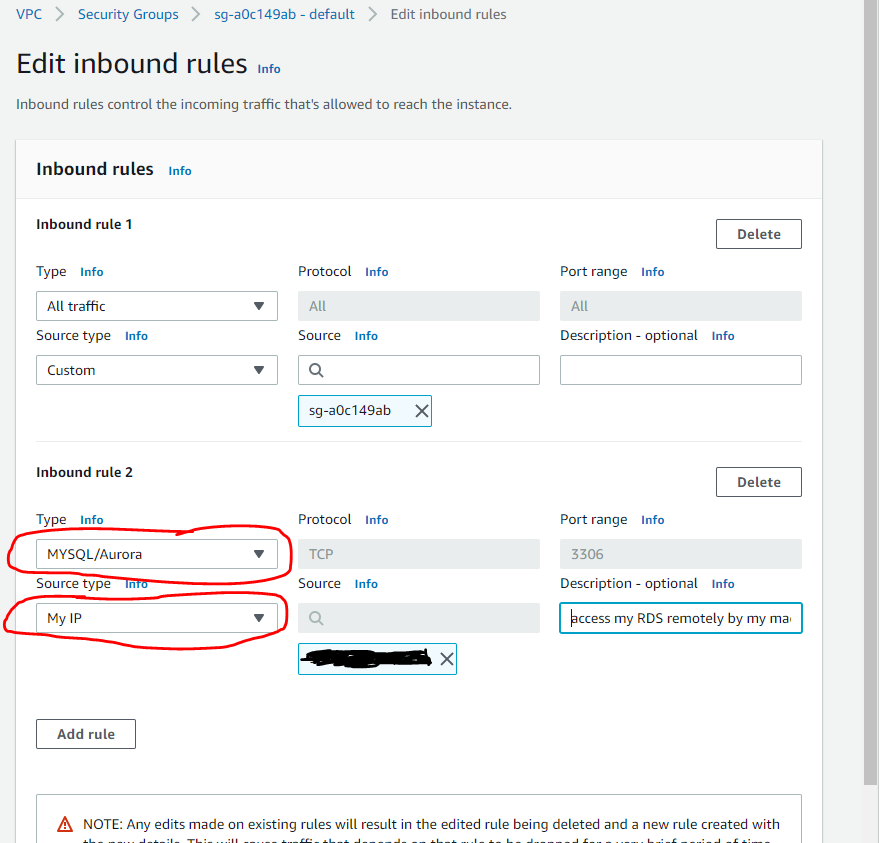

Now we will go back to AWS RDS. Select the instance that have initially created and copy the "Endpoint" detail:

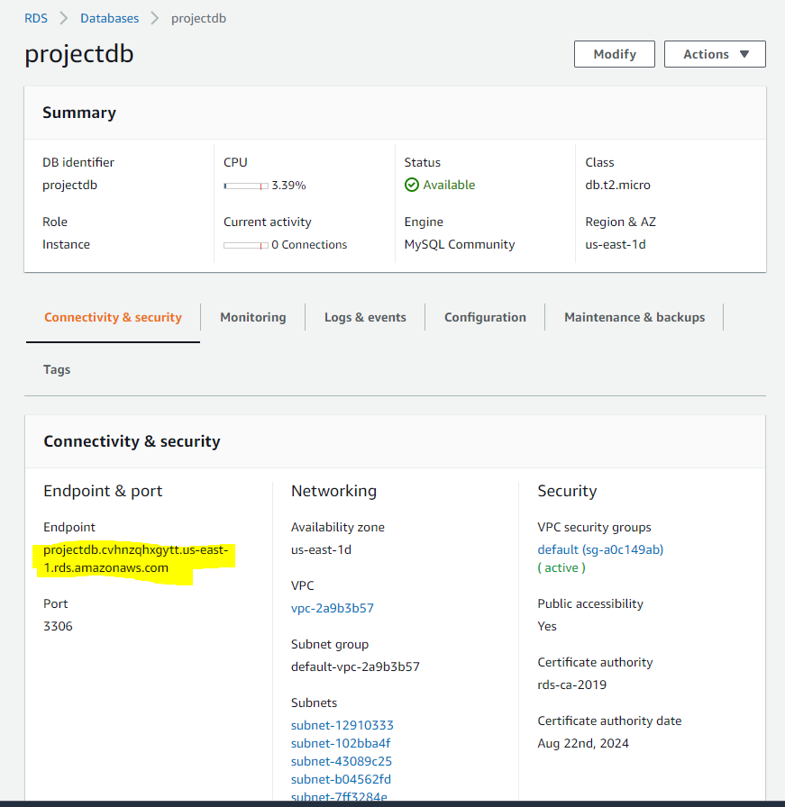

Now come back to our DBeaver application, enter the endpoint and the RDS Database Credentials that we have used while creating it initially. Test out the connection and if it is successful then proceed further:

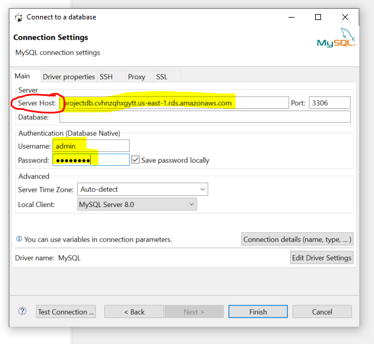

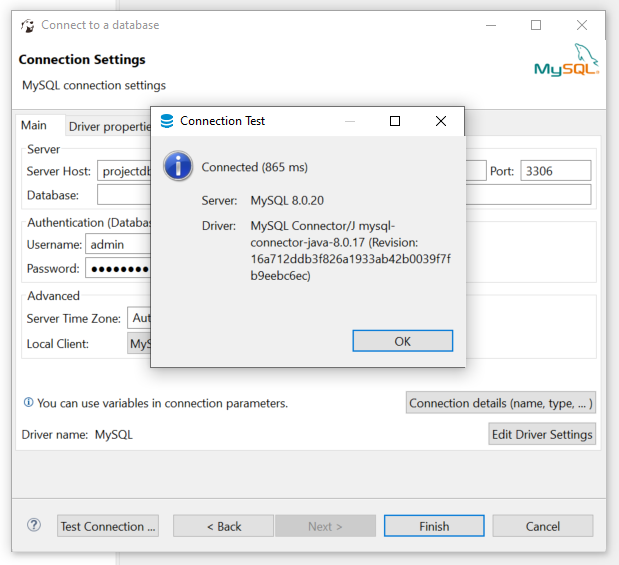

I have provided the SQL Script for creating the necessary database, tables and populating the tables. The Script can be found on this link [Click Me](https://github.com/PritomDas/Cloud-Computing-Projects/blob/main/Project%205.%20Data%20Engineering%20and%20BI%20in%20AWS/SQL%20Script%20for%20MySQL%20Database/full_db_dump.rar)

Pay close attention to "Connectivity". Let's choose "Public Access" as "Yes". We will also create a new security group instead of the default security group.

Rest everything stay as deafault and then create the database:

After successful creation the database should be avaialble in the databases dashboard :

### Part 2: Download a Local SQL Client

We will download the MySQL Workbench in our local system if it is not installed already. [Click Here](https://dev.mysql.com/downloads/mysql/) to locate the installer. After successful installation, it should be available in your local system. Add a new connection by pressing the  "+" button :

Head over to the AWS Management Console again and "View Credential Detail" of the RDS Instance:

Enter the following detials as shown on the following pic which I have tried to map from the AWS RDS Credential Detail to the MySQL Workbench Connection :

Test the connection, if it is successful then it should look something like this:

The connection should also appear in the MySQL Workbench dashboard from now onwards:

Double click the connection, whatever query is written here will be reflected in the AWS RDS portal:

### Delete the RDS Instance
Don't forget to delete all the RDS Instance as one can be billed after the free tier quota is over.

<!-- CONTACT -->

## Contact

Pritom Das Radheshyam - [Portfolio Website](https://pritom.uwu.ai/)
[![LinkedIn][linkedin-shield]][linkedin-url]  

<!-- MARKDOWN LINKS & IMAGES -->
<!-- https://www.markdownguide.org/basic-syntax/#reference-style-links -->

[linkedin-shield]: https://img.shields.io/badge/-LinkedIn-black.svg?style=flat-square&logo=linkedin&colorB=555
[linkedin-url]: https://www.linkedin.com/in/you-found-pritom
[product-screenshot]: images/screenshot.jpg

