<!-- PROJECT LOGO -->
 

  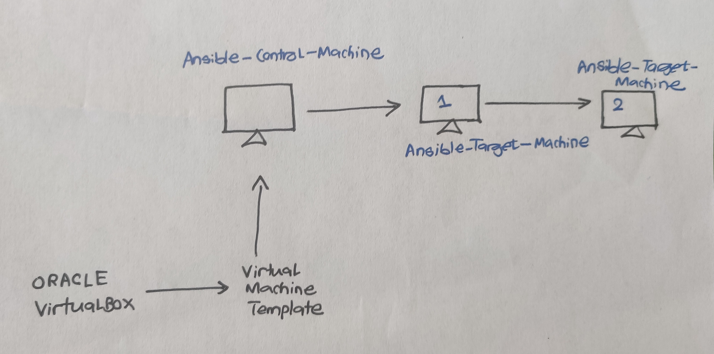

> AWS, RDS, MySQL, DBeaver, AWS Data Pipeline, AWS S3, AWS Quicksight
<!-- ABOUT THE PROJECT -->

# Ansible Project

## Project Description
This 

## Follow Along:

### Part 1: Install Virtual Box

Head over to the official website and download the version based on your desired operating system. [Click Me](https://www.virtualbox.org/wiki/Downloads)

After successful installation, it should look like this:

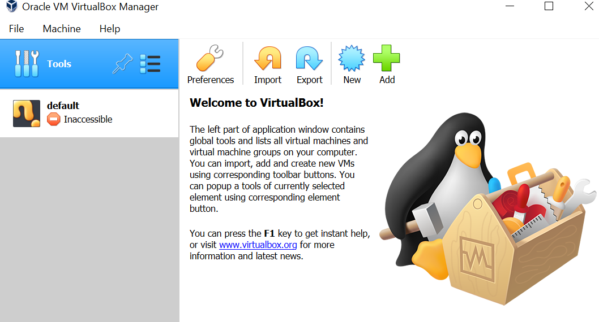

### Part 2: Get the CentOS VM

We will now get a preconfigured and preinstalled virtual machine image. I am going to use a CentOS VM(64 bit version) for this project. Head over to this [link](https://www.osboxes.org/centos/) to download the required image and kudos to [OSBoxes](https://www.osboxes.org/)

After using our dlownlaoded image in the virtualbox, it would look something like this:
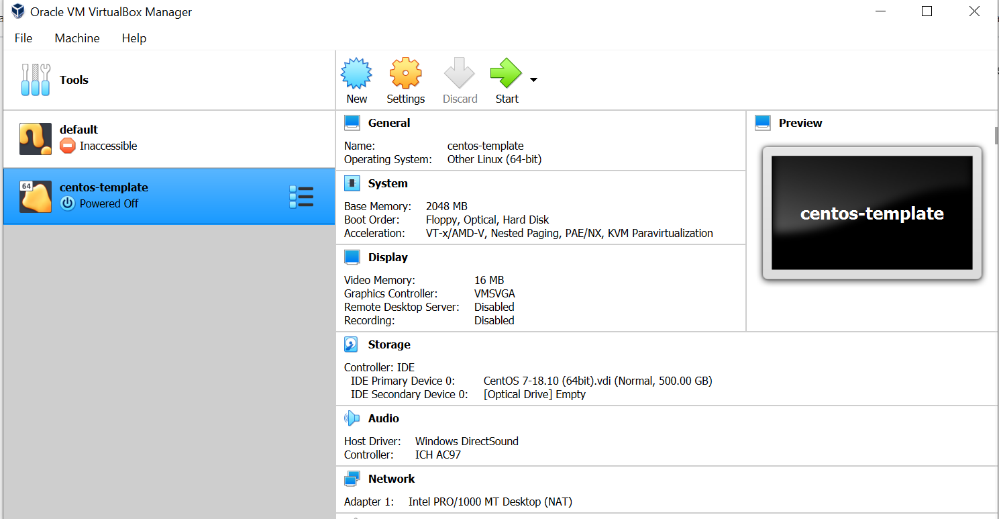

Go to VM setting and increase the CPU power and change the network settings from "NAT" to "Bridge Adapter" so that the VM can be connected to the internet. Turn on the VM and then for password, enter "osboxes.org". After successful login, go to Applications and open up a terminal. Let's try to find out the IP address assigned to our VM. This can be done by running "ipconfig":
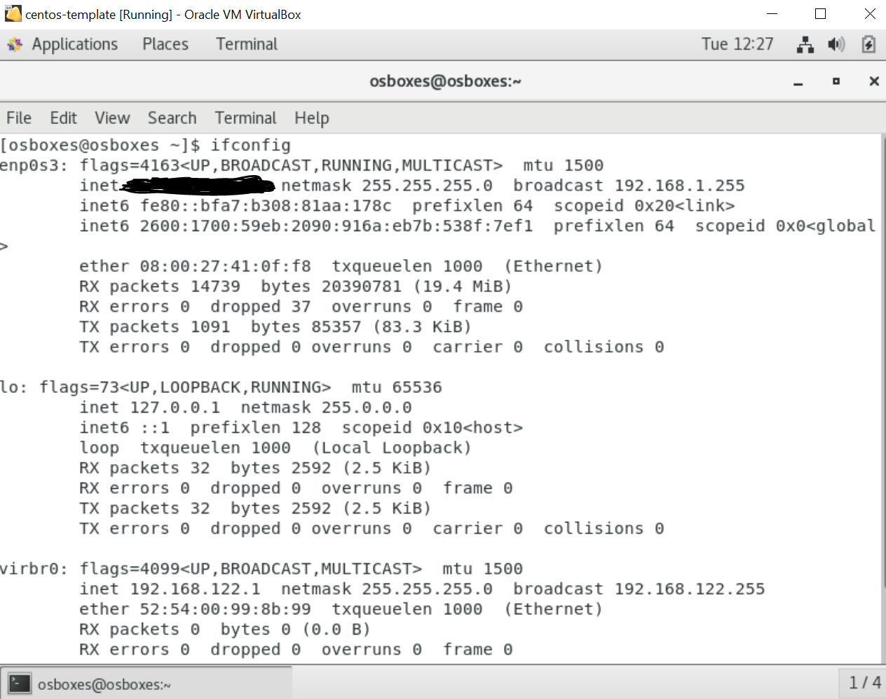

### Part 3: SSH Login to our VM (Remote Computing)

We can either use "Putty" or "MobaXterm". I will use the later one. Create a new ssh session and specify the IP adress of the vm with the user as the naem found in VM account login. After that we can shut down the VM from the virtualBox or do it remotely from the connected ssh remote connection.

After successful remote connection to our VM, it would look something like this, and I have decided not to mask my VM IP adress anymore:
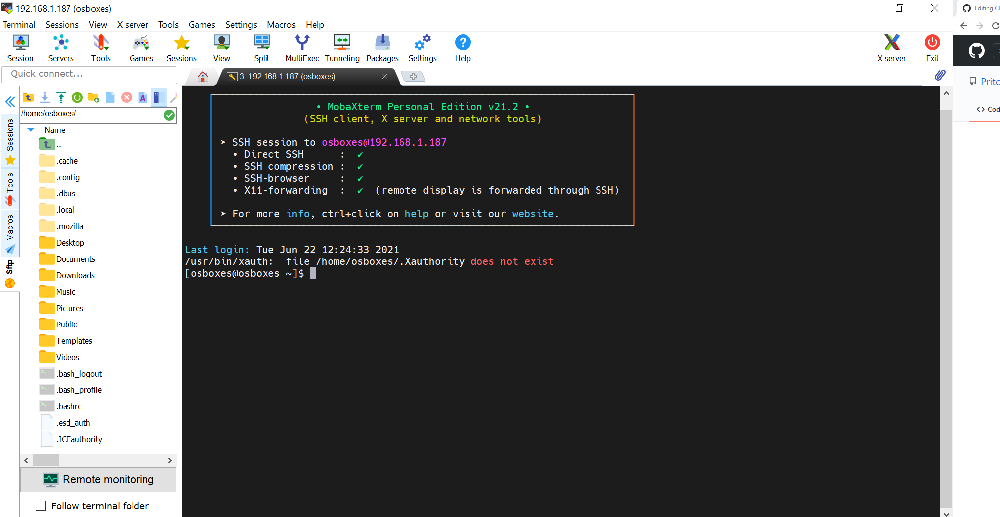

### Part 4: Clone VMs and Install Ansible 
Go to virtualbox, select the VM in poweroff state and chose the option Clone. We will create a Master Ansible Control Machine out of this one. Make sure to reinitialize new IP address to created VMs.
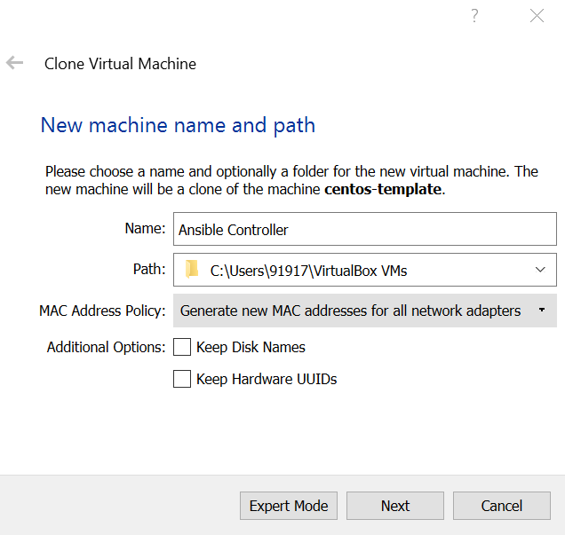
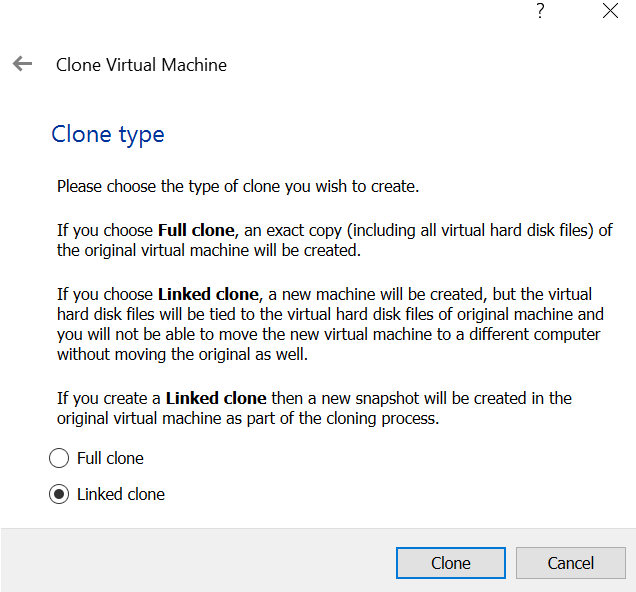

Similarly we will follow the same procedure for creating another clone for Ansible Target Machine.
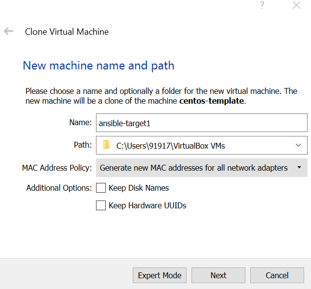
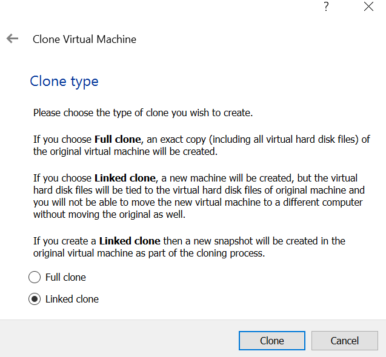

Let's find the IP addresses of our new VM clones by heading over terminal and runing ifconfig:
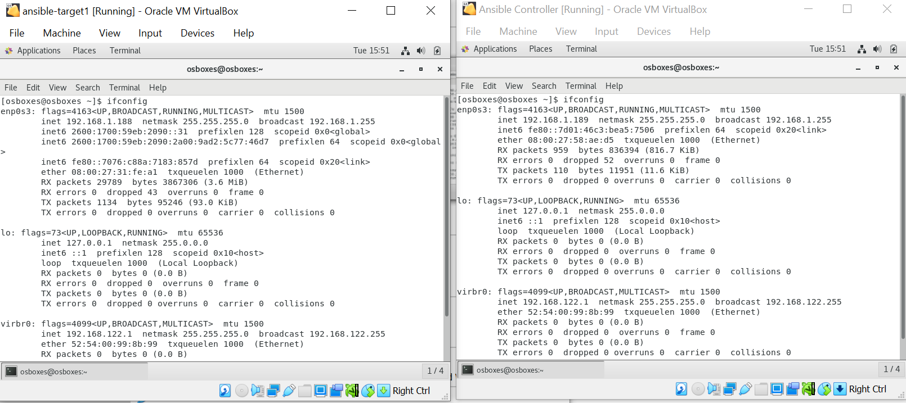

Now establish SSH connection between MobaXterm/Putty with the new VM clones:
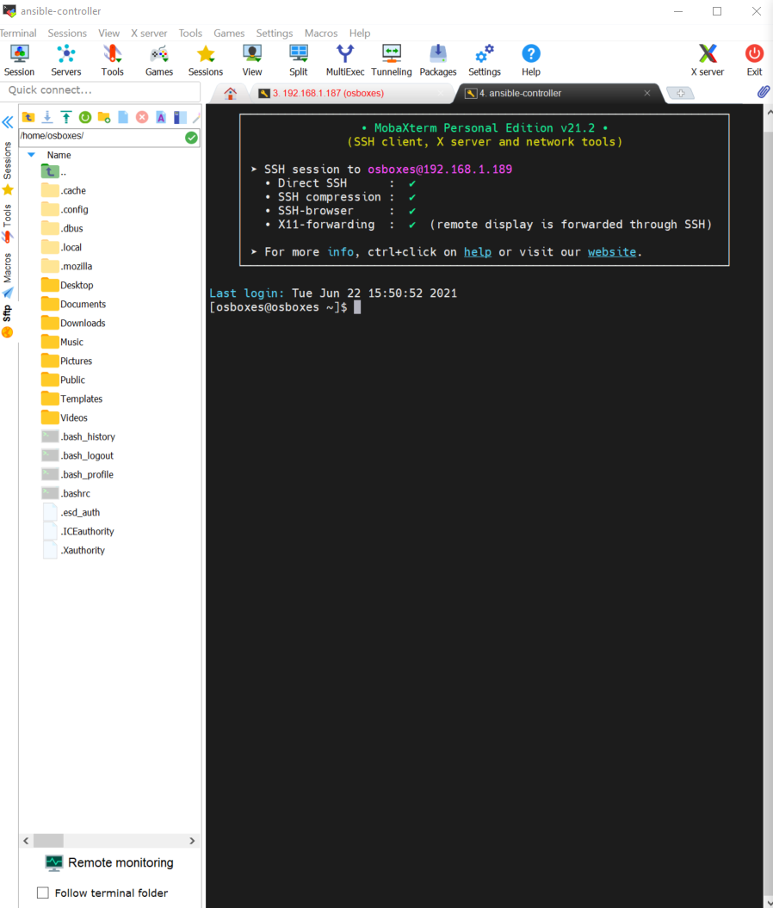
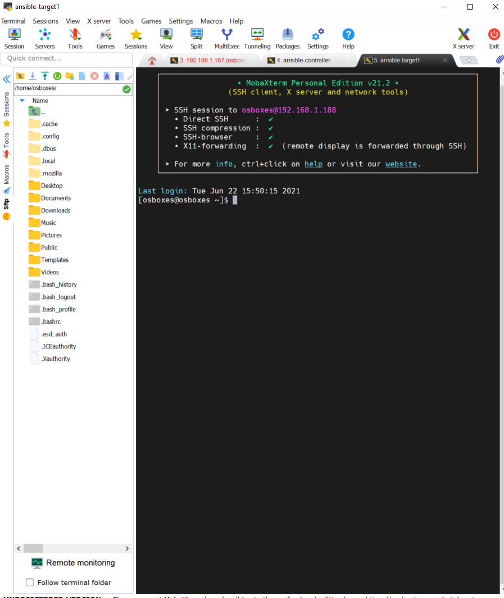

Similarly create another clone for Ansible-TargetMachine2.

Now, lets move forward by installing Ansible in our Ansible-Controller-Machine by using "sudo yum install ansible". This can be done by loggin inside the vm and running through the terminal, I am going to do remote installation through MobaXterm. The following [Ansible Official Documentation](https://docs.ansible.com/ansible/latest/installation_guide/intro_installation.html#installing-ansible-on-specific-operating-systems) has every details on how to install ansible to our required operating systems.
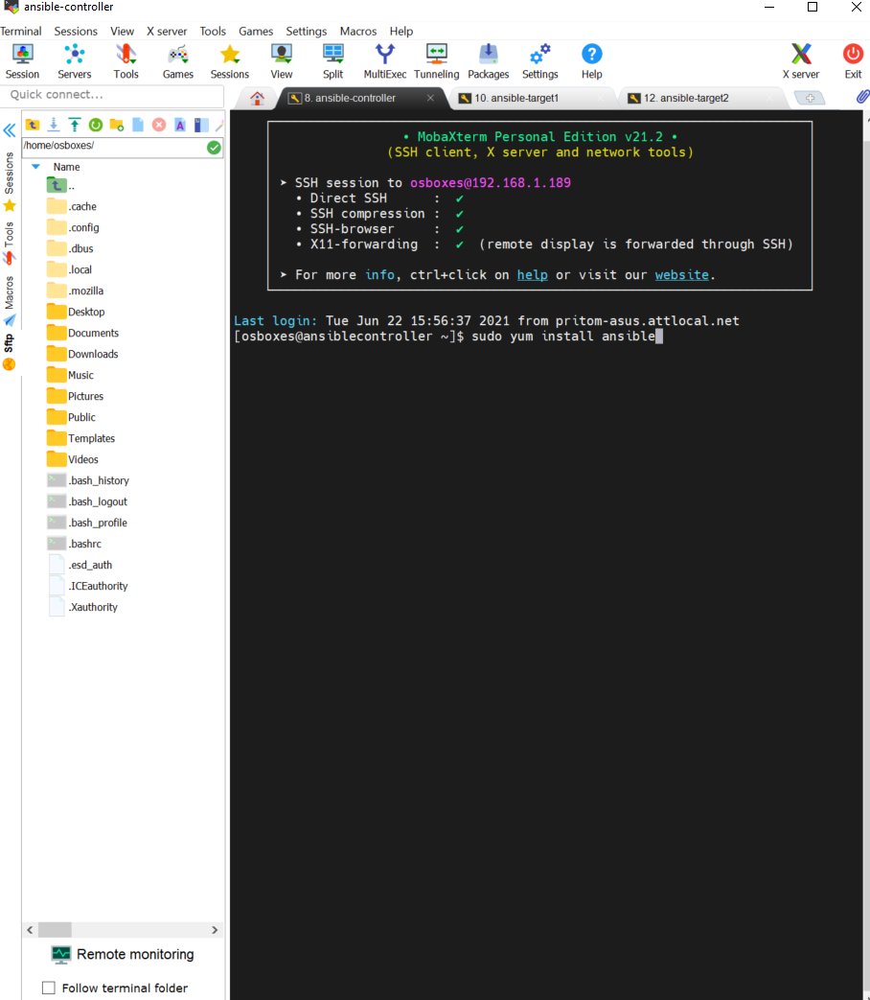

After successful installation of Ansible:
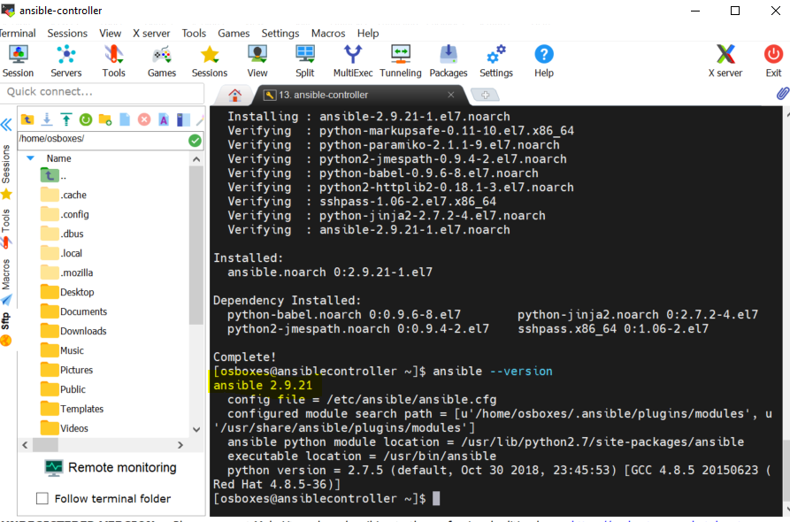

### Part 5: Ansible Inventory

Testing connection between Ansible-Controller-Machine with the Ansible-Target-Machine1
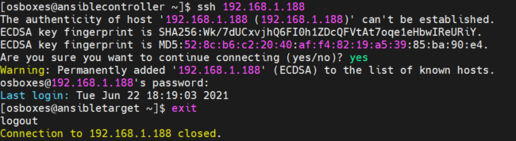

Now we will create an inventory file in our Ansible-Controller-Machine
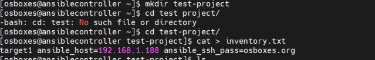

<!-- Ansible Theory -->
### FAQs about Ansible

Ansible Inventory?
 <b>

* This is the way ansible can perform orchesration of all the different target servers and is done in agentless manner.
* It makes uses of SSH(for Linux) and powershell(for windows).
* All the information about the target system is stored in the inventory file.
* If we don't create any then by default an inventory file is created by ansible and can be found under /etc/ansible/hosts
* Aliases in Ansible Inventory 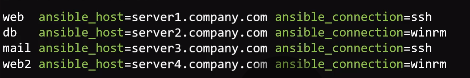

</b>

<!-- CONTACT -->

## Contact

Pritom Das Radheshyam - [Portfolio Website](https://pritom.uwu.ai/)
[![LinkedIn][linkedin-shield]][linkedin-url]  

<!-- MARKDOWN LINKS & IMAGES -->
<!-- https://www.markdownguide.org/basic-syntax/#reference-style-links -->

[linkedin-shield]: https://img.shields.io/badge/-LinkedIn-black.svg?style=flat-square&logo=linkedin&colorB=555
[linkedin-url]: https://www.linkedin.com/in/you-found-pritom
[product-screenshot]: images/screenshot.jpg

