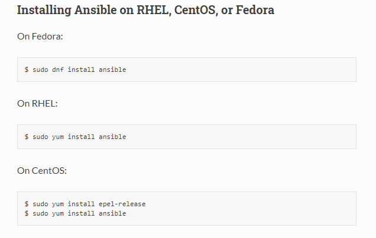

<!-- PROJECT LOGO -->
 

  

> Ansible, Infrastructure as a Code, IAAC, Linux, CentOS
<!-- ABOUT THE PROJECT -->

# Ansible Project for Remote Orchestration 

## Project Description
In this project we will try to work around with many linux based virtual machines, utilise ansible so that the Controller Virtual Machine can be utilised to perform remote orchestration of our target remote virtual machines.

## Follow Along:

### Part 1: Install Virtual Box

Head over to the official website and download the version based on your desired operating system. [Click Me](https://www.virtualbox.org/wiki/Downloads)

After successful installation, it should look like this:

### Part 2: Get the CentOS VM

We will now get a preconfigured and preinstalled virtual machine image. I am going to use a CentOS VM(64 bit version) for this project. Head over to this [link](https://www.osboxes.org/centos/) to download the required image and kudos to [OSBoxes](https://www.osboxes.org/)

After using our dlownlaoded image in the virtualbox, it would look something like this:

Go to VM setting and increase the CPU power and change the network settings from "NAT" to "Bridge Adapter" so that the VM can be connected to the internet. Turn on the VM and then for password, enter "osboxes.org". After successful login, go to Applications and open up a terminal. Let's try to find out the IP address assigned to our VM. This can be done by running "ipconfig":

### Part 3: SSH Login to our VM (Remote Computing)

We can either use "Putty" or "MobaXterm". I will use the later one. Create a new ssh session and specify the IP adress of the vm with the user as the naem found in VM account login. After that we can shut down the VM from the virtualBox or do it remotely from the connected ssh remote connection.

After successful remote connection to our VM, it would look something like this, and I have decided not to mask my VM IP adress anymore:

### Part 4: Clone VMs and Install Ansible 
Go to virtualbox, select the VM in poweroff state and chose the option Clone. We will create a Master Ansible Control Machine out of this one. Make sure to reinitialize new IP address to created VMs.

Similarly we will follow the same procedure for creating another clone for Ansible Target Machine.

Let's find the IP addresses of our new VM clones by heading over terminal and runing ifconfig:

Now establish SSH connection between MobaXterm/Putty with the new VM clones:

Similarly create another clone for Ansible-TargetMachine2.

Now, lets move forward by installing Ansible in our Ansible-Controller-Machine by using "sudo yum install ansible". This can be done by loggin inside the vm and running through the terminal, I am going to do remote installation through MobaXterm. The following [Ansible Official Documentation](https://docs.ansible.com/ansible/latest/installation_guide/intro_installation.html#installing-ansible-on-specific-operating-systems) has every details on how to install ansible to our required operating systems.

After successful installation of Ansible:

### Part 5: Ansible Inventory

Testing connection between Ansible-Controller-Machine with the Ansible-Target-Machine1

Now we will create an inventory file in our Ansible-Controller-Machine

Let's try to ping from our controller machine and see if we can establish a ssh connection with our target machine using our ansible script

<!-- Ansible Theory -->
### FAQs about Ansible

Ansible Inventory?
 <b>

* This is the way ansible can perform orchesration of all the different target servers and is done in agentless manner.
* It makes uses of SSH(for Linux) and powershell(for windows).
* All the information about the target system is stored in the inventory file.
* If we don't create any then by default an inventory file is created by ansible and can be found under /etc/ansible/hosts
* Aliases in Ansible Inventory 

</b>

Ansible Playbook?
 <b>

* Playbooks are the files where Ansible code is written. Playbooks are written in YAML format. YAML stands for Yet Another Markup Language.
* Playbooks are one of the core features of Ansible and tell Ansible what to execute. They are like a to-do list for Ansible that contains a list of tasks.
* Playbooks contain the steps which the user wants to execute on a particular machine.
* Ansible Playbooks offer a repeatable, re-usable, simple configuration management and multi-machine deployment system, one that is well suited to deploying complex applications. If you need to execute a task with Ansible more than once, write a playbook and put it under source control. Then you can use the playbook to push out new configuration or confirm the configuration of remote systems. 
* Each playbook looks like a dictionary of lists in YAML. For eg: 
* Executing ansible playbook syntax: ansible-playbook playbookname.yml
</b>

Example of Ansible Use Case?
 <b>

If you want to install the new version of WebLogic/WebSphere server on all of the machines present in your enterprise, it is not feasible for you to manually go and update each and every machine.

You can install WebLogic/WebSphere in one go on all of your machines with Ansible playbooks and inventory written in the most simple way. All you have to do is list out the IP addresses of your nodes in the inventory and write a playbook to install WebLogic/WebSphere. Run the playbook from your control machine & it will be installed on all your nodes.
</b>

How does Ansible work?
 <b>

Ansible works by connecting to your nodes and pushing out small programs, called "Ansible modules" to them. Ansible then executes these modules (over SSH by default), and removes them when finished. Your library of modules can reside on any machine, and there are no servers, daemons, or databases required.

The management node is the controlling node (managing node) which controls the entire execution of the playbook. It’s the node from which you are running the installation. The inventory file provides the list of hosts where the Ansible modules needs to be run and the management node does a SSH connection and executes the small modules on the hosts machine and installs the product/software.
</b>

What are the types of ansible machine for deployment?
 <b>

  * Control machine − Machine from where we can manage other machines.
  * Remote machine − Machines which are handled/controlled by control machine.
</b>

<!-- CONTACT -->

## Contact

Pritom Das Radheshyam - [Portfolio Website](https://pritom.uwu.ai/)
[![LinkedIn][linkedin-shield]][linkedin-url]  

<!-- MARKDOWN LINKS & IMAGES -->
<!-- https://www.markdownguide.org/basic-syntax/#reference-style-links -->

[linkedin-shield]: https://img.shields.io/badge/-LinkedIn-black.svg?style=flat-square&logo=linkedin&colorB=555
[linkedin-url]: https://www.linkedin.com/in/you-found-pritom
[product-screenshot]: images/screenshot.jpg

