<!-- PROJECT LOGO -->
<br />

<p align="center">
  
</p>


> Kubernetes, Ansible, Git, Jenkins, Docker, CI/CD Pipelines, DevOps, DevSecOps, AWS
<!-- ABOUT THE PROJECT -->

# DevOps CI/CD pipelines using Git, Jenkins, Ansible, Docker and Kubernetes on AWS

## DevOps Tools Used in this Project

<details>
<summary>Git</summary><br><b>

This will be used for source code management.
</b></details>

<details>
<summary>Jenkins</summary><br><b>

This will be used for creating CI/CD Pipelines.
</b></details>

<details>
<summary>Maven</summary><br><b>

This will be used as a build tool.
</b></details>

<details>
<summary>Ansible</summary><br><b>

This will be used for configuration management and deployment.
</b></details>

<details>
<summary>Docker</summary><br><b>

This will be used as a Target Environment to host our applications
</b></details>

<details>
<summary>Kubernetes</summary><br><b>

To manage our Docker Containers.
</b></details>

<details>
<summary>AWS</summary><br><b>

We will set all out various tools over the Cloud using AWS.
</b></details>

# Building CI/CD Pipeline using Git, Jenkins and Maven

### Jenkins Installation in AWS EC2

Head over to AWS Management Console and spin up any Linux based free tier EC2 instance. Keep everything default except make sure to open up 8080 port during security group configuration as Jenkins run on this port.


Once the EC2 is created, use any preferred remote computation tool of your choice to login to the EC2 erver from your local machine. I am going to use MobaXterm but even Putty is also going to work well.


Once successfully we get access to our EC2, make sure to change to root user since we would do couple of installations.


Check if is Java is installed in the EC2 instance, if not then install java using the yum install java command. Get the latest version from http://openjdk.java.net/install/
   ```sh
   yum install java-1.8*
   #yum -y install java-1.8.0-openjdk-devel
   ```
Make sure to set path to the Java in this EC2 Linux machine, attaching everything step by step would make this very long so I am going to assume that by now we all know how to do this. I have used this [youtube tutorial](https://www.youtube.com/watch?v=c_nF2RnyfDU)


To setup Jenkins Repository in our EC2 Instance, use the following [Jenkins Official Documentation](https://pkg.jenkins.io/redhat-stable/)
   ```sh
  sudo wget -O /etc/yum.repos.d/jenkins.repo https://pkg.jenkins.io/redhat-stable/jenkins.repo
  sudo rpm --import https://pkg.jenkins.io/redhat-stable/jenkins.io.key
  yum install jenkins
   ```
Check start and stop state of Jenkins
   ```sh
  service jenkins status
  service jenkins start

   ```
   
   
   
Copy the public IPv4 address of the ec2 instance and open it in a browser with :8080 extension. After some initial steps to setup Jenkins for the first time, we will be able to get the Jenkins User Interface.
 

Noe goto Jenkins Global Tool Configuration to set the JDK.


Running Jenkins Job


### Git Setup
We will install git in our EC2 instance. Run the following command from MobaXterm and then after this head over to Jenkins and add GitHub plugin in the Jenkins Portal.
   ```sh
yum install git -y

   ```

# Integration of Tomcat server with CI/CD pipeline

### Apache TomCat Web Server Setup

Create another EC2 instance and use the similar configuration as before. We will install the apache tomcat server over here. Then use this [link address](https://tomcat.apache.org/download-80.cgi) to install Tomcat server in our EC2 instance. We will use the startup.sh for starting the tomcat in our new EC2 instance. Make sure to install Java and add the path in environmental variable like before.


If all this worked well then we will be able to access our Tomcat server from our web browser itself.


Luckily our build was successful, I did had to spend a lot of time on this step, for some reason my jenkins plugin wasn't detecting tomcat server for deployment.


### Deploy war file on Tomcat server using Jenkins


Luckily our build was successful, I did had to spend a lot of time on this step, for some reason my jenkins plugin wasn't detecting tomcat server for deployment.


### Deploy on VM through PollSCM

This step is very essential to make sure whenever there is new code, the jenkins job should do automated build. We will modify the existing job that we bulit for Tomcat server and make some minor tweaks.
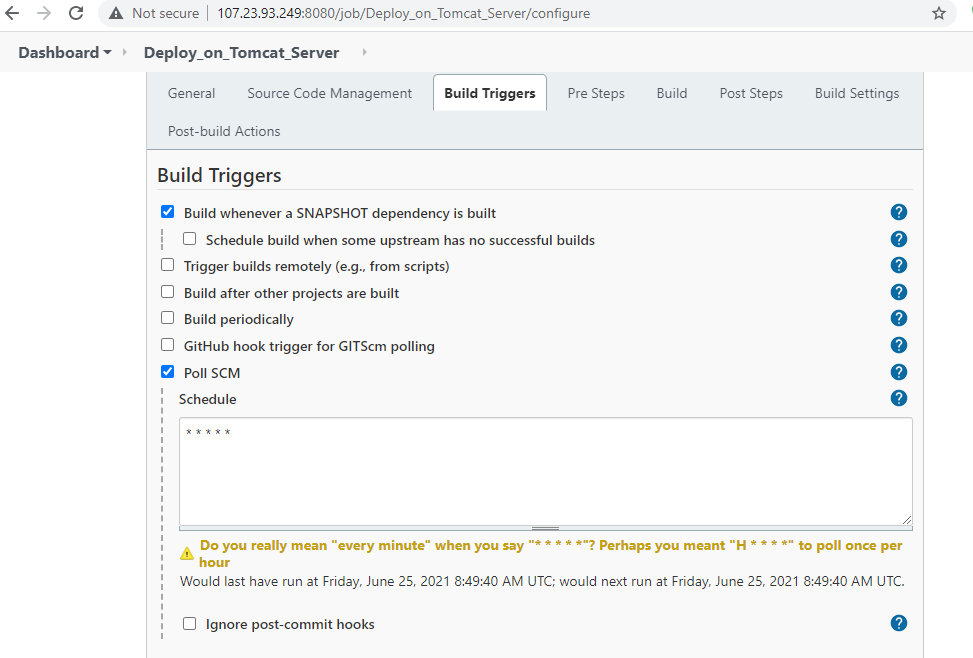

Now the time to testify, we will make some small changes to our website's index page and see if it gets updated to our github through our CI/CD pipeline

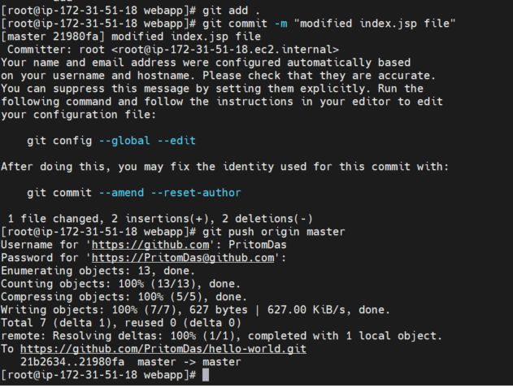
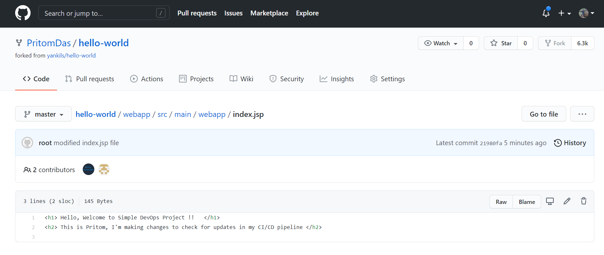

# Integration of Docker in CI/CD pipeline

We will now create a Docker host by spinning up our 3rd EC2 instance. This Docker host will contain all our docker containers. Once the EC2 instance is ready, establish connection with MobaXterm. After this we will install docker in this EC2 instance.

   ```sh
yum install docker

   ```

Check start and stop state of Docker
   ```sh
  service docker status
  service docker start

   ```
Another very useful command for docker is the following which lists all running docker containers.

   ```sh
  docker ps

   ```
Currently we have no docker containers running yet.

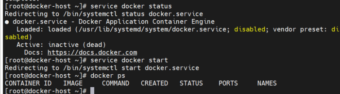

Now headover to DockerHub and we will pull an official Tomcat Docker image. This image can be found on [here](https://hub.docker.com/_/tomcat)

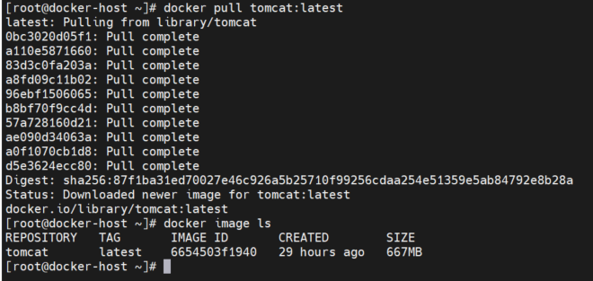

Let's now create a container from this docker image.

   ```sh
docker run --name tomcat-container -p 8080:8080 tomcat:latest

   ```


### Jenkins Job to copy artifacts onto DockerHost

Create a new job in Jenkins and make sure to choose the below selected option:
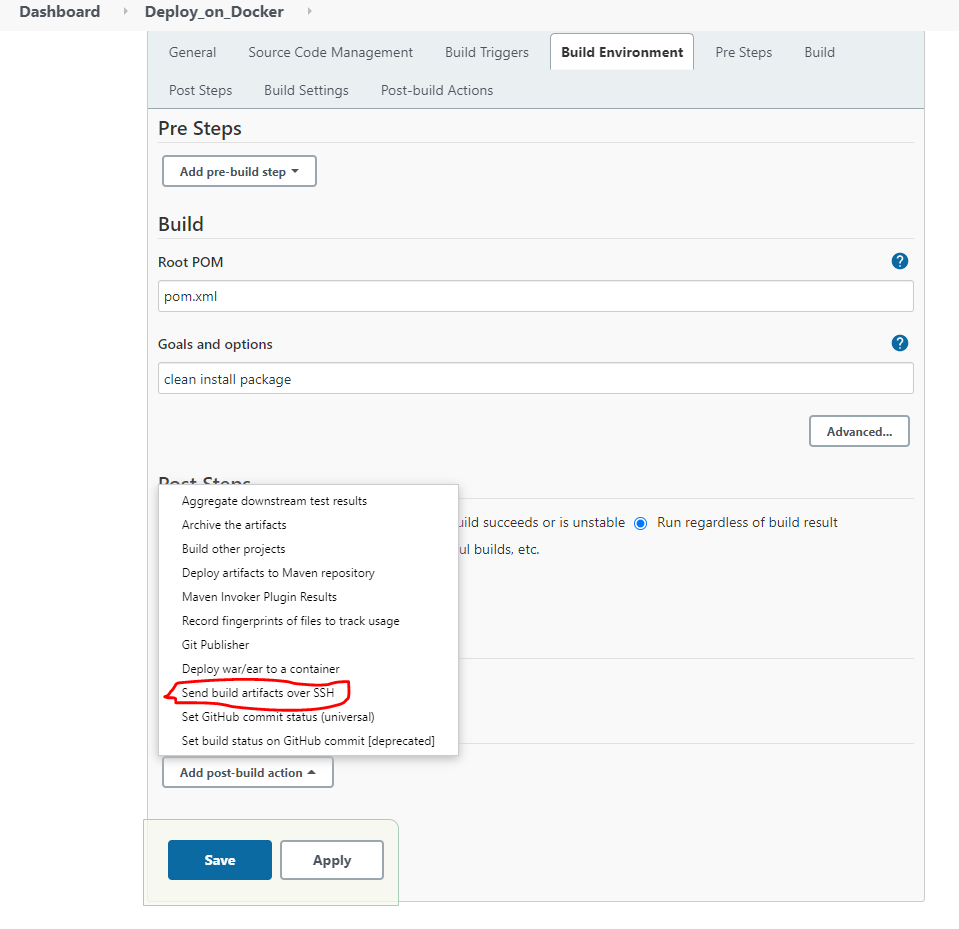
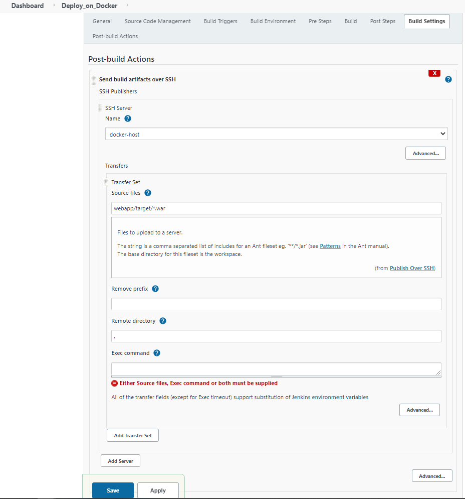

Our build was successful

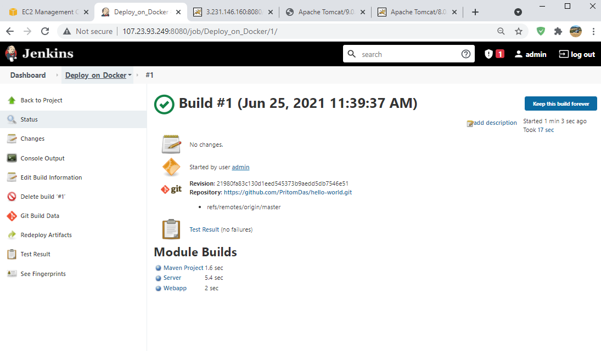

### Creating a Dockerfile

   ```sh
FROM tomcat:latest

MAINTAINER Pritom Das Radheshyam

COPY ./webapp.war /usr/local/tomcat/webapps

   ```

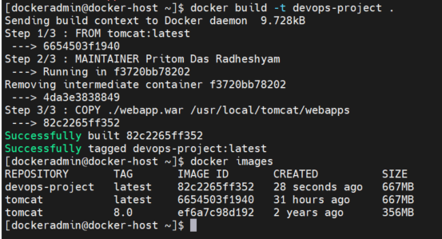

The following commad will create a docker container out of our docker image.

   ```sh
docker run --name devops-container -p 8080:8080 devops-project

   ```

Our container is working fine and we can access our container which is hosting the website
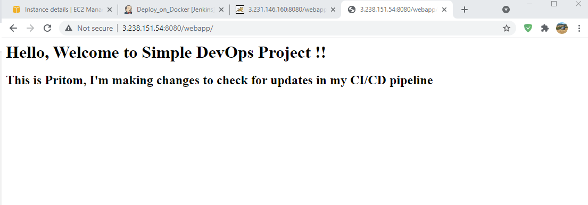

### Deploy a war file on Docker container using jenkins

We go back to our jenkins server and create a new job.

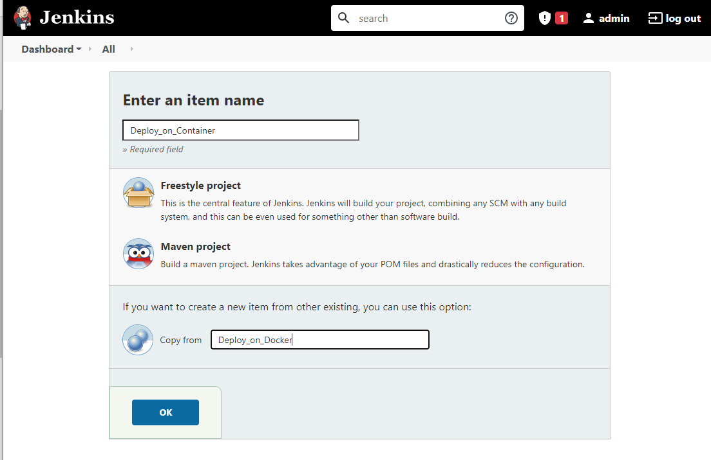

We will initially push our docker file in dockerhost, once it is available in dockerhost then we will create a docker image out of it, those necessary command will be executed through "Send build artifacts over SSH".

   ```sh
cd /home/dockeradmin; docker build -t devops-image . ; docker run -d --name devops-container -p 8080:8080 devops-image;

   ```

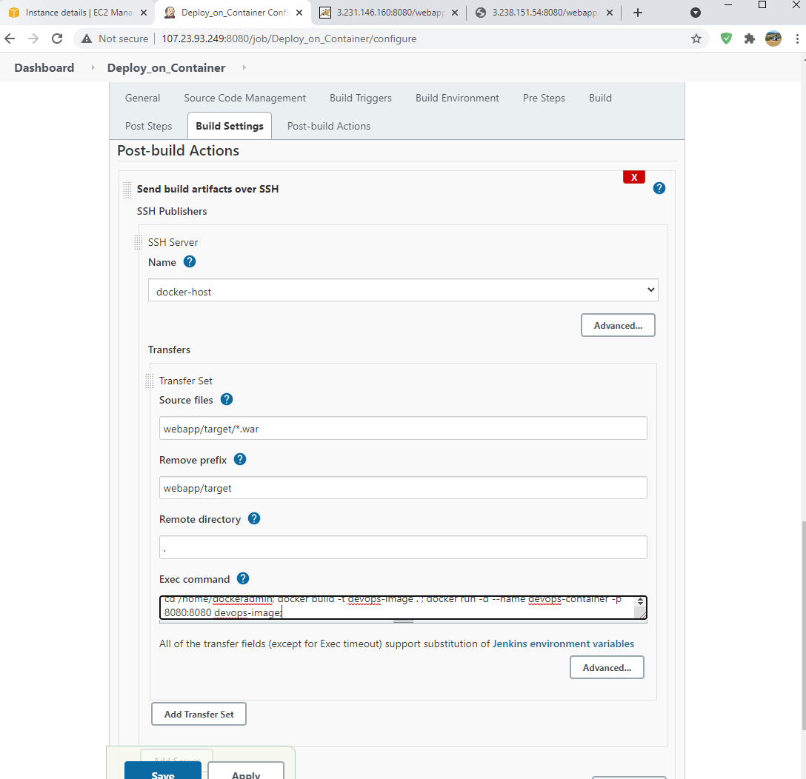

Now build the job and we should be able to get a new docker image and docker container available.


# Ansible for Continuous Deployment

Spin up another EC2 instance which will be our Ansible server. Then follow the below installation steps on Amazon EC2 instance:

1. Install python and python-pip
   ```sh
   yum install python
   yum install python-pip
   ```
1. Install ansible using pip check for version
    ```sh
    pip install ansible
   ansible --version
   ```
   
1. Create a user called ansadmin (on Control node and Managed host)  
   ```sh
   useradd ansadmin
   passwd ansadmin
   ```
1. Below command grant sudo access to ansadmin user. But we strongly recommended using "visudo" command if you are aware vi or nano editor.  (on Control node and Managed host)
   ```sh
   echo "ansadmin ALL=(ALL) NOPASSWD: ALL" >> /etc/sudoers
   ```
   
1. Log in as a ansadmin user on master and generate ssh key (on Control node)
   ```sh 
   sudo su - ansadmin
   ssh-keygen
   ```
1. Copy keys onto all ansible managed hosts (on Control node)
   ```sh 
   ssh-copy-id ansadmin@<target-server>
   ```

1. Ansible server used to create images and store on docker registry. Hence install docker, start docker services and add ansadmin to the docker group. 
   ```sh
   yum install docker
   
   # start docker services 
   service docker start
   service docker start 
   
   # add user to docker group 
   usermod -aG docker ansadmin

   ```
1. Create a directory /etc/ansible and create an inventory file called "hosts" add control node and managed hosts IP addresses to it. 

Validation test

   
1. Run ansible command as ansadmin user it should be successful (Master)
   ```sh 
   ansible all -m ping
   ```
After successful installation of anisble in our Ansible Server

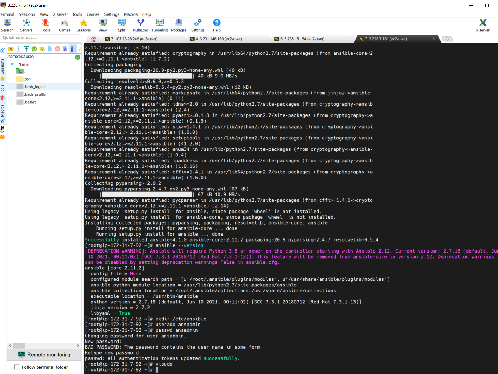

After that we need to install docker in this EC2 Instance and then we will also generate our public and private key pairs. We need to keep a copy of our public key in all our target machines.cd

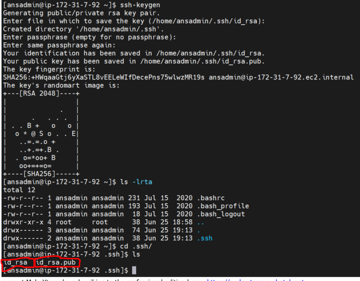

Transferring the public keys between our ansile server and dockerhost server is very crucial.

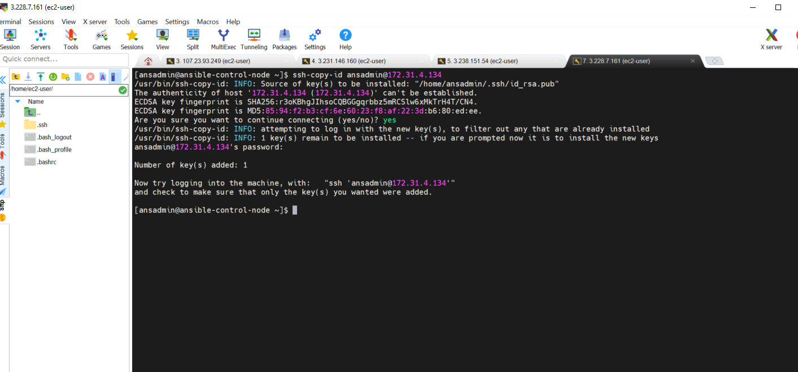

Before performing the ping test, we will copy the public keys to our localhost in the ansible server. After this we will add the necessary IPv4 address in our hosts file in Ansible. Following these two steps will help us to successfully perform the ping test. Our pipeline is successful which means anytime a new image is available on the Ansible-Control-Node, it will auto deploy the coker image to the Docker-Host.


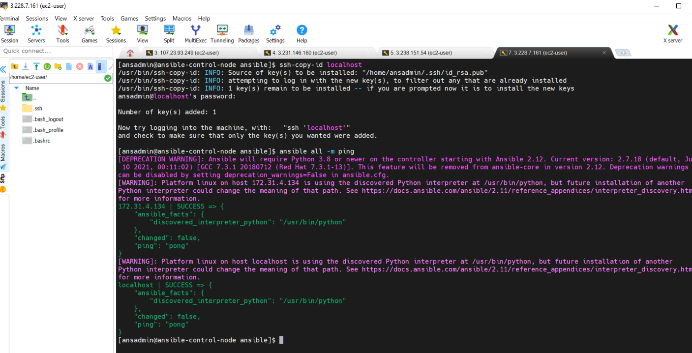

## Integration of Ansible and Jenkins

Head over to Jenkins Web Console and we will need to do further integration from there. We will add another SSH server:

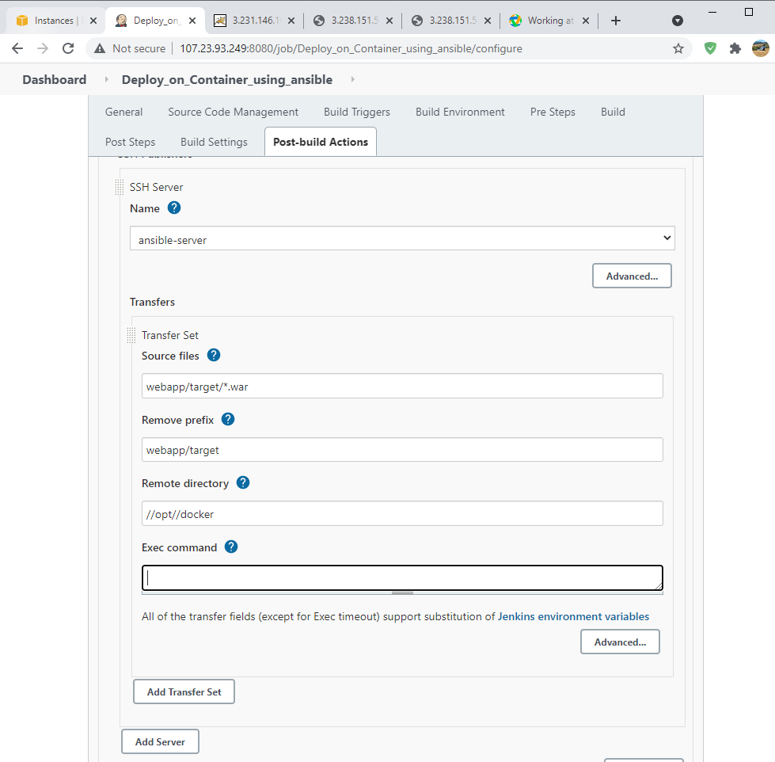

We will now need to write a Ansible Playbook which can integrate Dockerfile and War file into a Docker Image.


   ```sh 
  ---
- hosts: all
  become: true

  tasks:
  - name: build docker image using war file
    command: docker build -t simple-devops-image .
    args:
      chdir: /opt/docker

   ```
The CI/CD pipeline with ansible worked like a charm and it was successful

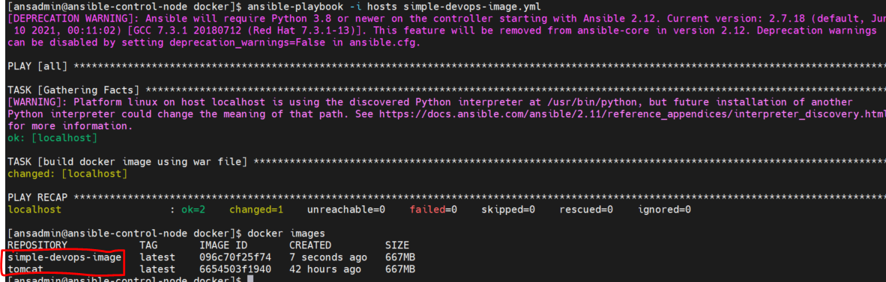


# Kubernetes Integration with CI/CD Pipeline

Create Ubuntu EC2 instance
1. install AWSCLI
   ```sh
    curl https://s3.amazonaws.com/aws-cli/awscli-bundle.zip -o awscli-bundle.zip
    apt install unzip python
    unzip awscli-bundle.zip
    #sudo apt-get install unzip - if you dont have unzip in your system
    ./awscli-bundle/install -i /usr/local/aws -b /usr/local/bin/aws
    
    ```
    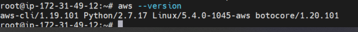

1. Install kubectl on ubuntu instance
   ```sh
   
   curl -LO https://storage.googleapis.com/kubernetes-release/release/$(curl -s https://storage.googleapis.com/kubernetes-release/release/stable.txt)/bin/linux/amd64/kubectl
    chmod +x ./kubectl
    sudo mv ./kubectl /usr/local/bin/kubectl
   ```

1. Install kops on ubuntu instance
   ```sh
    curl -LO  https://github.com/kubernetes/kops/releases/download/1.15.0/kops-linux-amd64
    chmod +x kops-linux-amd64
    sudo mv kops-linux-amd64 /usr/local/bin/kops
    kops version (it should be 1.15.0)
    Note: use below command if you wish to use latest version. For now we could see latest version of kops. So ignore it until further update. 
    # curl -LO https://github.com/kubernetes/kops/releases/download/$(curl -s https://api.github.com/repos/kubernetes/kops/releases/latest | grep tag_name | cut -d '"' -f 4)/kops-linux-amd64

    ```
1. Create an IAM user/role  with Route53, EC2, IAM and S3 full access

1. Attach IAM role to ubuntu instance
   ```sh
   # Note: If you create IAM user with programmatic access then provide Access keys. Otherwise region information is enough
   aws configure
    ```
    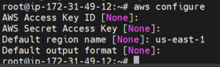 

1. Create a Route53 private hosted zone (you can create Public hosted zone if you have a domain)
   ```sh
   Routeh53 --> hosted zones --> created hosted zone  
   Domain Name: valaxy.net
   Type: Private hosted zone for Amazon VPC. Make sure you are chosing right VPC if you have multiple
   ```
   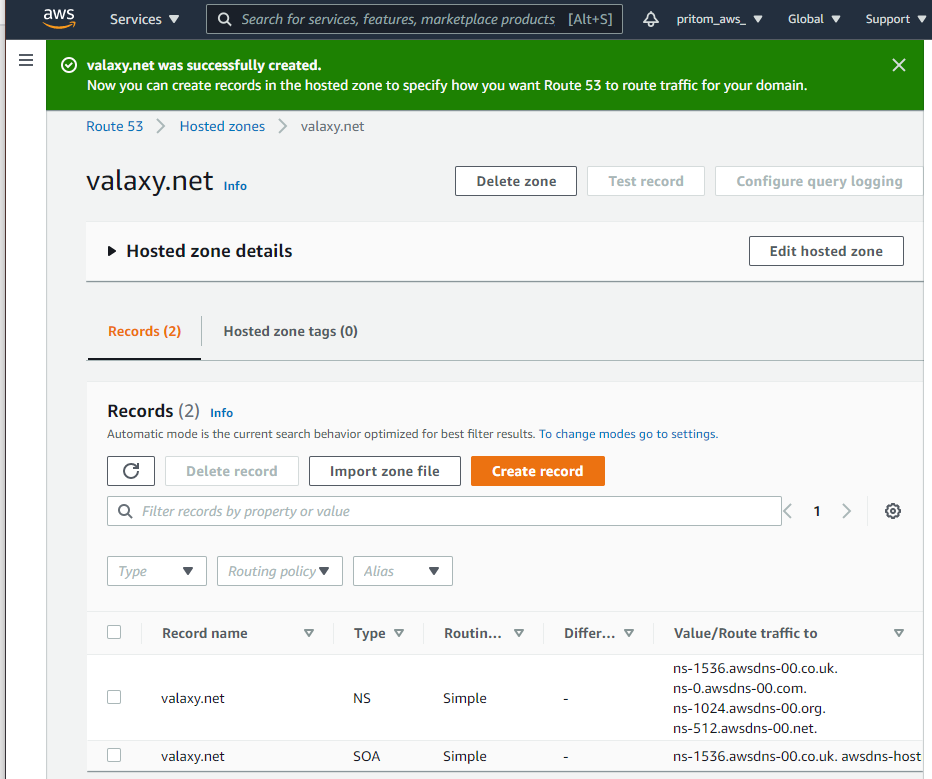

1. create an S3 bucket
   ```sh
    aws s3 mb s3://demo.pritomk8s.valaxy.net
   ```
1. Expose environment variable:
   ```sh
    export KOPS_STATE_STORE=s3://demo.pritomk8s.valaxy.net
   ```

1. Create sshkeys before creating cluster
   ```sh
    ssh-keygen
   ```

1. Create kubernetes cluster definitions on S3 bucket
   ```sh
   kops create cluster --cloud=aws --zones=ap-south-1b --name=demo.pritomk8s.valaxy.net --dns-zone=valaxy.net --dns private 
    ```

1. Create kubernetes cluser
    ```sh
    kops update cluster demo.pritomk8s.valaxy.net --yes
    ```
1. To cahnge the kubernetes master and worker instance sizes 
   ```sh 
   kops edit ig --name=<cluster_name> nodes
   #kops edit ig --name=demo.pritomk8s.valaxy.net nodes 
   kops edit ig --name=<cluster_name> master-<zone_name>
   #kops edit ig --name=demo.pritomk8s.valaxy.net master-ap-south-1b
   ```
1. to Delete cluster (try once your lab is done)
   ```sh 
   kops delete cluster <cluster_name> --yes
   ```
1. Validate your cluster
     ```sh
      kops validate cluster
    ```

1. To list nodes
   ```sh
   kubectl get nodes
   ```


<!-- CONTACT -->

## Contact

Pritom Das Radheshyam - [Portfolio Website](https://pritom.uwu.ai/)
[![LinkedIn][linkedin-shield]][linkedin-url]  


<!-- MARKDOWN LINKS & IMAGES -->
<!-- https://www.markdownguide.org/basic-syntax/#reference-style-links -->

[linkedin-shield]: https://img.shields.io/badge/-LinkedIn-black.svg?style=flat-square&logo=linkedin&colorB=555
[linkedin-url]: https://www.linkedin.com/in/you-found-pritom
[product-screenshot]: images/screenshot.jpg

