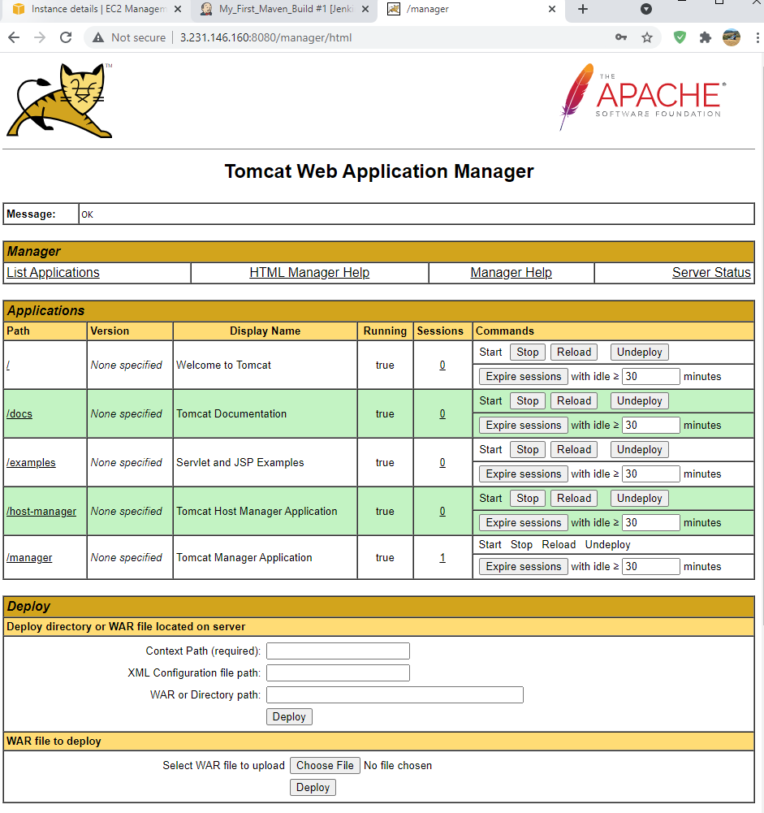

<!-- PROJECT LOGO -->
<br />

<p align="center">
  
</p>


> Kubernetes, Ansible, Git, Jenkins, Docker, CI/CD Pipelines, DevOps, DevSecOps, AWS
<!-- ABOUT THE PROJECT -->

# DevOps CI/CD pipelines using Git, Jenkins, Ansible, Docker and Kubernetes on AWS

## DevOps Tools Used in this Project

<details>
<summary>Git</summary><br><b>

This will be used for source code management.
</b></details>

<details>
<summary>Jenkins</summary><br><b>

This will be used for creating CI/CD Pipelines.
</b></details>

<details>
<summary>Maven</summary><br><b>

This will be used as a build tool.
</b></details>

<details>
<summary>Ansible</summary><br><b>

This will be used for configuration management and deployment.
</b></details>

<details>
<summary>Docker</summary><br><b>

This will be used as a Target Environment to host our applications
</b></details>

<details>
<summary>Kubernetes</summary><br><b>

To manage our Docker Containers.
</b></details>

<details>
<summary>AWS</summary><br><b>

We will set all out various tools over the Cloud using AWS.
</b></details>

# Building CI/CD Pipeline using Git, Jenkins and Maven

### Jenkins Installation in AWS EC2

Head over to AWS Management Console and spin up any Linux based free tier EC2 instance. Keep everything default except make sure to open up 8080 port during security group configuration as Jenkins run on this port.


Once the EC2 is created, use any preferred remote computation tool of your choice to login to the EC2 erver from your local machine. I am going to use MobaXterm but even Putty is also going to work well.


Once successfully we get access to our EC2, make sure to change to root user since we would do couple of installations.


Check if is Java is installed in the EC2 instance, if not then install java using the yum install java command. Get the latest version from http://openjdk.java.net/install/
   ```sh
   yum install java-1.8*
   #yum -y install java-1.8.0-openjdk-devel
   ```
Make sure to set path to the Java in this EC2 Linux machine, attaching everything step by step would make this very long so I am going to assume that by now we all know how to do this. I have used this [youtube tutorial](https://www.youtube.com/watch?v=c_nF2RnyfDU)


To setup Jenkins Repository in our EC2 Instance, use the following [Jenkins Official Documentation](https://pkg.jenkins.io/redhat-stable/)
   ```sh
  sudo wget -O /etc/yum.repos.d/jenkins.repo https://pkg.jenkins.io/redhat-stable/jenkins.repo
  sudo rpm --import https://pkg.jenkins.io/redhat-stable/jenkins.io.key
  yum install jenkins
   ```
Check start and stop state of Jenkins
   ```sh
  service jenkins status
  service jenkins start

   ```
   
   
   
Copy the public IPv4 address of the ec2 instance and open it in a browser with :8080 extension. After some initial steps to setup Jenkins for the first time, we will be able to get the Jenkins User Interface.
 

Noe goto Jenkins Global Tool Configuration to set the JDK.


Running Jenkins Job


### Git Setup
We will install git in our EC2 instance. Run the following command from MobaXterm and then after this head over to Jenkins and add GitHub plugin in the Jenkins Portal.
   ```sh
yum install git -y

   ```

# Integration of Tomcat server with CI/CD pipeline

### Apache TomCat Web Server Setup

Create another EC2 instance and use the similar configuration as before. We will install the apache tomcat server over here. Then use this [link address](https://tomcat.apache.org/download-80.cgi) to install Tomcat server in our EC2 instance. We will use the startup.sh for starting the tomcat in our new EC2 instance. Make sure to install Java and add the path in environmental variable like before.


If all this worked well then we will be able to access our Tomcat server from our web browser itself.



Luckily our build was successful, I did had to spend a lot of time on this step, for some reason my jenkins plugin wasn't detecting tomcat server for deployment.


### Deploy war file on Tomcat server using Jenkins


Luckily our build was successful, I did had to spend a lot of time on this step, for some reason my jenkins plugin wasn't detecting tomcat server for deployment.


<!-- CONTACT -->

## Contact

Pritom Das Radheshyam - [Portfolio Website](https://pritom.uwu.ai/)
[![LinkedIn][linkedin-shield]][linkedin-url]  


<!-- MARKDOWN LINKS & IMAGES -->
<!-- https://www.markdownguide.org/basic-syntax/#reference-style-links -->

[linkedin-shield]: https://img.shields.io/badge/-LinkedIn-black.svg?style=flat-square&logo=linkedin&colorB=555
[linkedin-url]: https://www.linkedin.com/in/you-found-pritom
[product-screenshot]: images/screenshot.jpg

